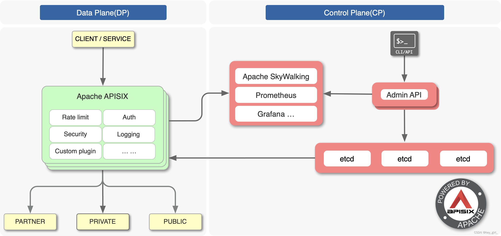

# APISIX


## 基础介绍

基于nginx的网关中间件、依赖etcd
开源的 动态、高性能、云原生的 API 网关，支持服务发现、负载均衡、认证、限流、监控、插件热更新等功能




apisix开发端口
- 9080：HTTP
- 9443：HTTPS
- 9180：Admin API


### apisix.yml
```yaml
apisix:
    admin_key:
        name:
        key:
        role:
    enable_admin:
    node_listen:
etcd:
    host:
```

apisix配置文件


### api-http
```yaml
/apisix:
    /admin/routes: # 创建路由
        uri:
        upstream:
            type:
            nodes:
        plugins: # 路由插件配置
            limit-count:
                count:
                time_window:
                rejected_code:
                key:
```

## 核心内容