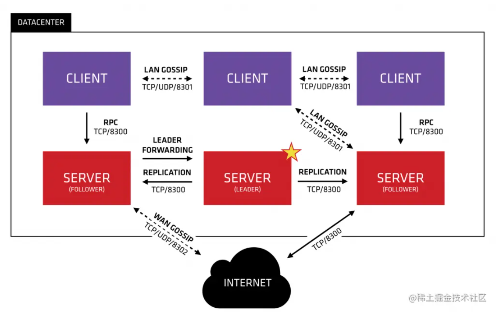

# consul


## 基础介绍

服务发现、配置管理、监控检查、多数据中心中间件
默认8500端口

环境变量：
- CONSUL_HTTP_TOKEN：




Consul架构：
```txt
                ┌──────────────┐
                │  Consul UI   │
                └─────▲────────┘
                      │ HTTP API
┌───────┐       ┌─────┴──────┐       ┌────────┐
│Client │──────►│ Server 集群│◄──────│ Client │
└───────┘       └─────┬──────┘       └────────┘
                      │
                Key-Value / Service 注册
```
- Agent：每个节点运行一个 Consul Agent，可以是 server 或 client
    - Client模式：转发服务注册/查询等请求给 Server（Client Agent为“代理网关”）
    - Server模式：负责选主、存储状态等核心工作，建议奇数个（3/5）
- Datacenter：逻辑上的一个 Consul 集群


- Consul服务域名规则：`服务名.service.consul`
- 自己的应用是直接连接Agent Client就行
- 每台机器都要运行一个Agent（Client 模式）
    - client负责跟server通信，处理转发服务注册、服务发现请求到server节点
    - client还负责服务的健康检查
    - client节点可以部署多个实例，甚至每个微服务节点都部署一个client实例
- server模式启动，即可当server、也可当client
    - server负责核心数据的存储和处理请求
    - server可以部署多个实例(通常推荐3-5个)
    - server只有一个leader实例，就是主节点，主节点是通过选举产生的
    - 主节点负责数据的写入处理，同时将数据同步至其他server节点


### consul
```yaml
consul:
    --help:
    acl: # ACL管理
        bootstrap:
        policy: # ACL策略
            create:
                -name: # <policy-name>
                -rules: # '<HCL规则>'
            list: # 
        token: # Token
            create:
                -description:
                -policy-name: # 指定token的 acl策略
            delete:
            list:
    agent: # agent启动
        -client: # Client 模式启动
            -bind:
            -data-dir:
            -node: # 节点名称
            -retry-join: # 加入server集群
        -dev: # 快速启动一个单节点 Consul 集群，方便开发调试和本地测试(默认是单节点 Server+Client 模式)
        -server: # 生产 Server 节点启动
            -bind: # ip绑定
            -bootstrap-expect: # 期待集群节点数
            -client: # 客户端地址
            -config-dir: # 配置目录
            -data-dir:
            -ui:
            -node: # 节点名称
    catalog: # 集群信息查看
        nodes: # 查看所有节点
        service: # 查询服务实例
        services: # 查看所有注册服务
    check: # 手动健康管理
        fail: # 手动标记健康检查失败
        pass: # 手动标记健康检查通过（适用于 TTL 类型）
    connect:
    debug: # 以 debug 级别启动 agent
    event:
    exec:
    force-leave:
    health: # 健康管理
        checks: # 查看所有健康检查
        service: # 查看服务健康状态
    info: # 查看当前集群中所有节点及状态
    intention:
    join: # 加入集群
    keygen: # 生成加密密钥（用于 Gossip 加密集群通信等）
    kv: # kv键值对管理
        delete:
            -recurse:
        get:
            -recurse:
        put:
            -acquire: # 锁定 Key（acquire）
            -release: # 释放锁（release）
    leave: # 当前节点主动退出集群
    lock:
    login:
    logout:
    members: # 集群节点查看
    monitor: # 实时查看事件日志（控制台）
    reload: # 重新加载配置文件
    services: # 服务管理
        deregister: # 注销服务
        register: # 服务注册
    session: # 会话管理
        create:
        list:
    snapshot: # 集群快照
        restore:
        save:
    version: # 版本
    watch: # 
```

#### consul-template
```yaml
consul-template:
    -consul-addr:
    -template:
```

后台进程，实时监听consul服务
根据consul信息生成模板配置文件
- 刷新网关中服务节点的配置信息


#### api-http
```yaml
consul:
    /v1:
        /agent/service/deregister: # 注销服务实例
        /catalog/register: # 
        /catalog/service:
        /health/service:
        /kv/{my-key}:
```


### consul.d

配置目录

#### client.json
```yaml
client.hcl:
    datacenter: # 数据中心名字，唯一
    data-dir:
    encrypt: # consul节点之间通信的密钥
    retry_join: # 其他server节点地址(支持ip地址、域名)，填一个即可，会自动加入集群
```

agent client配置


#### server.json
```yaml
server.json:
    acl:
    encrypt: # 集群通讯加密
    datacenter: # 数据中心名字，唯一
    data-dir:
    encrypt: # consul节点之间通信的密钥
    server: # 代表当前agent以服务端模式启动
    bootstrap_expect: # 代表需要部署3个server节点
    retry_join: # 其他server节点地址(支持ip地址、域名)，填一个即可，会自动加入集群
    start_join:
    node_name: # 节点名称
    primary_datacenter:
    ui:
    watches:
```

agent server配置


#### web.json
```yaml
web.json:
    service:
        name:
        tags:
        port:
        checks: # 健康检查
```

应用配置文件方式的服务注册


## 核心内容
```yaml
```


### Agent

Consul Agent 是 Consul 的运行单元，部署在每台机器上。它是服务注册、健康检查、服务发现等操作的实际执行者
- 所有节点都必须运行 Agent
- Agent 分为两种角色
    - Client Agent：运行在应用所在节点，处理服务注册/查询，转发到 Server。
    - Server Agent：组成 Consul 的核心集群，负责选主、数据存储和一致性维护


#### Client Agent

客户端代理应用，用于和应用程序对接

#### Server Agent

服务端代理应用，用于Consul集群选主Master、内部数据存储


### Datacenter

命名空间
Datacenter 是 Consul 的逻辑集群单位。每个 Datacenter 是一个完全独立的集群，通常代表物理或虚拟数据中心


#### Service


##### Instances


服务实例


#### Node
##### Health Checks

服务健康检查


#### KV


#### ACL


##### Tokens


token可赋予Role角色、Policy权限


##### Roles

角色
Role可赋予Policy权限


##### Policeis
```yaml
node: # 节点匹配
service_prefix: # 服务前缀匹配
    policy:
        write:
```


节点权限配置


## Web Console

- Services
    - Instances
    - Tags
- Nodes
- Key/Value
- ACL
    - Tokens
    - Roles
    - Policies
- Intentions

web控制台，默认8500端口