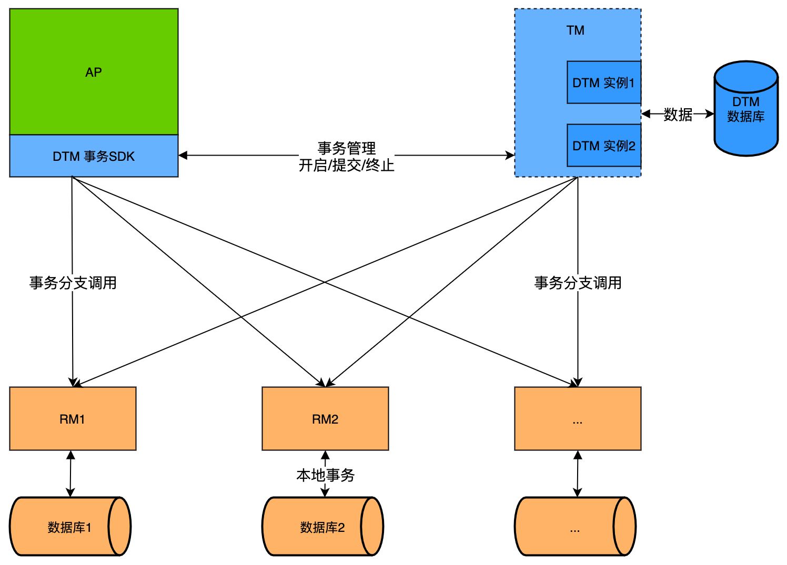
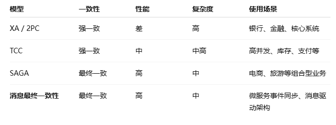

# DTM


## 基础介绍


分布式事务中间件（国产）




分布式事务目标：保证多个参与方在网络/系统可能失败的情况下，仍然能实现 一致性（最终或强一致）



### XA
```txt
          协调者
             |
       ------+-------
       |            |
    服务A        服务B
       \          /
        ---事务---
```

2PC的工业实现（XA 实现了 2PC，依赖数据库支持）
同步阻塞、占用资源长


基于2PC两阶段提交理论（协调者、参与者），实现强一致性
1. prepare：参与方准备事务并锁定资源
2. commit：协调者通知正式提交或回滚


XA关键组件：
TM（Transaction Manager，事务管理器）：负责协调事务（就是 2PC 的协调者）
RM（Resource Manager，资源管理器）：比如数据库，执行具体的事务操作


XA核心步骤：
第一阶段：准备阶段（Prepare phase）
- 协调者通知所有参与者：“准备提交事务”
- 各参与者执行本地事务（但不提交），并返回准备就绪（Yes）或失败（No）

第二阶段：提交/回滚阶段（Commit/Rollback phase）
- 如果所有参与者都返回 Yes，协调者通知全部“正式提交”
- 否则，通知所有参与者“回滚”

XA标准接口：
- xa_start
- xa_end
- xa_prepare
- xa_commit
- xa_rollback


### TCC
```txt
分布式事务协调器（TCC 管理器）
       |
    Try 阶段
   /     \
服务 A   服务 B
冻结资源 冻结资源

协调成功：
    └── Confirm 阶段（并发）
          服务 A 提交
          服务 B 提交

协调失败：
    └── Cancel 阶段（并发）
          服务 A 回滚
          服务 B 回滚
```

分布式事务中一种强一致性、灵活可控、业务侵入式的事务控制模式
解决了 2PC 同步阻塞、性能差等问题
每个服务自己控制资源，不依赖数据库的 XA 支持

Try-Confirm-Cancel 三步操作	，服务必须实现三套 API，并可补偿
1. Try：预留资源（A 账户扣款冻结（不实际转账））
2. Confirm：执行提交（A 账户正式转出给 B 账户）
3. Cancel：释放资源（解冻 A 账户的金额）


TCC核心实现：
- 每个服务都要实现 Try/Confirm/Cancel 三个接口
- Try 阶段只预留资源，不做真实业务提交
- Confirm / Cancel 都要是幂等的，防止重复执行
- 无需锁全局资源、非阻塞


### SAGA
```txt
Saga 协调器
    |
  Tx1（下单）——> Tx2（扣库存）——> Tx3（扣余额）
    |               |                   |
  C1（回滚）<——  C2（回滚）    <——  C3（失败）
```

将一个长事务拆分为多个局部事务（本地事务），并通过补偿（Compensation）机制来实现回滚，适用于 高性能、弱一致容忍的业务场景
- 实现最终一致性
- SAGA 是由一系列可独立提交的局部事务（子事务）组成，每个子事务都有一个对应的“补偿操作”用于回滚
- 长事务分解为多个局部事务，每步失败回滚前一步


基于补偿回滚

SAGA核心实现：
- 要确保补偿能回滚业务效果
- 补偿操作必须幂等
- 子事务允许失败重试
- 顺序执行/补偿子事务，防止并发破坏一致性
- Saga 协调器要持久化事务状态，支持恢复


### 消息最终一致性
```txt
【服务A】
  ├── 写本地数据库 (本地事务)
  ├── 写消息表 (记录需要发送的消息)
  └── 提交事务后，再发送消息到 MQ

【MQ】
  └── 将消息投递给服务B

【服务B】
  ├── 消费消息，执行业务
  └── 返回成功，标记消息状态
```

消息最终一致性就是：先保证本地事务成功，再通过消息中间件异步通知其他系统，确保所有系统最终达到一致状态

依赖 MQ，生产者发送消息，消费者幂等消费并确认
最终一致性，时延不确定


消息最终一致性实现方案：

方案一：本地消息表 + 定时任务
1. 服务A执行本地事务（包括业务操作 + 写入一条消息到消息表）
2. 提交事务成功后，异步任务读取消息表中的消息发送到 MQ
3. MQ 投递给 B 系统
4. 消费成功后，A/B 更新消息状态为 “完成”

方案二：事务消息（RocketMQ 专有）
RocketMQ、Kafka 等支持 事务消息（Transactional Message）：
1. Producer 先发送 “半消息”
2. 服务 A 执行本地事务
3. 提交成功，通知 MQ 提交消息；失败则回滚


## 核心内容