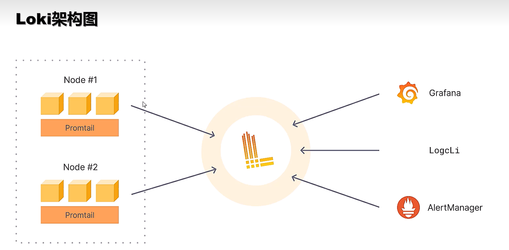
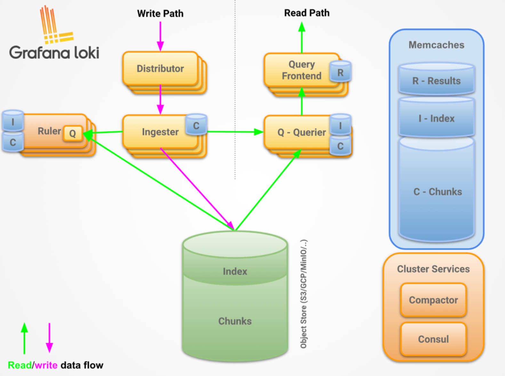

# Grafana

`k8s + loki 日志解决方案: P6`


## 基础介绍

日志可视化平台（类似ELK技术栈）


Docker Compose安装：
```yaml
name: sylvie233-pythontest

services:
  loki:
    image: grafana/loki:2.9.0
    container_name: loki
    ports:
      - "3100:3100"
    command: -config.file=/etc/loki/local-config.yaml # 指定配置文件
    volumes:
      - ./loki-data:/loki # 数据挂载
    networks:
      - grafana-network

  promtail:
    image: grafana/promtail:2.9.0
    container_name: promtail
    command: -config.file=/etc/promtail/config.yaml
    volumes:
      - ./promtail/config.yaml:/etc/promtail/config.yaml #  指定配置文件
      - ./logs:/logs   # Windows 本地 logs 文件夹挂载
    depends_on:
      - loki
    networks:
      - grafana-network

  grafana:
    image: grafana/grafana:10.1.1
    container_name: grafana
    ports:
      - "3000:3000"
    environment:
      - GF_SECURITY_ADMIN_USER=admin
      - GF_SECURITY_ADMIN_PASSWORD=admin
    depends_on:
      - loki
    networks:
      - grafana-network

networks:
  grafana-network:
    driver: bridge
```


## 核心内容

### Home
### Starred
### Dashboards

展示面板

### Explore

开发板


### Alerting

告警配置

### Connections

连接配置

### Administration


## Loki

一个水平可扩展、高可用、多租户的日志聚合系统
日志聚合系统、支持集群部署
index + chunk




Loki日志写入流程：应用程序 -> （写入日志文件） -> Promtail （采集并添加标签） -> Loki Distributor -> Loki Ingester （内存处理） -> 长期存储（如S3）
```
Grafana
   │
   ▼
Query Frontend ────► Querier ────► Ingester + Storage
   ▲                                │
   │                                │
   └─────────────── Cache ◄─────────┘
```

Loki日志读取流程：用户 -> Grafana （发起 LogQL 查询） -> Loki Query Frontend -> Loki Querier -> （查询 Ingester 和 长期存储） -> 返回结果给 Grafana


loki-data数据目录结构：
```yaml
loki-data:
    /boltdb-shipper-active:
    /boltdb-shipper-cache:
    /chunks: # 日志块分片
    /compactor:
    /rules:
    /wal:
```

Loki部署模式：
- 单体模式（Single binary）：所有模块都在一个进程
- 简单可扩展模式（Simple scalable）：官方推荐，Querier/Ingester 分层
- 微服务模式（Microservices）：每个组件独立部署


- 为日志打标签，而不是索引日志内容本身
- config.yaml配置文件
    - server：服务配置
    - common：
    - ingester：日志写入缓存和分块策略
    - schema_config：日志索引 schema 和存储方式
    - storage_config：存储位置
    - limits_config：限制策略
    - table_manager：索引管理和日志保留策略
    - querier: 查询配置
    - ruler：
- 具有相同标签的日志组成一个「日志流」、日志流的日志会被 按时间切分成块（chunk） 存储


### loki-config.yaml
```yaml
auth_enabled: false # 启用/禁用 Loki 的认证

server: # 服务监听配置
  http_listen_port: 3100
  grpc_listen_port: 9095 # GRPC 端口，用于内部服务通信
  log_level: 
  http_server_read_timeout: # 
  http_server_write_timeout:
  max_concurrent_streams: # gRPC 最大并发流

common: # 公共配置
  path_prefix:
  storage:
    filesystem:
  replication_factor:
  ring:

ingester: # 日志接收与写入
  lifecycler: # 管理节点在 ring（环）中的状态
    address: 127.0.0.1
    ring:
      kvstore:
        store: inmemory # 单机模式使用内存保存节点信息
      replication_factor: 1 # 副本数
  chunk_idle_period: 5m # 日志块闲置多久就切分新的 chunk
  chunk_retain_period: 30s # 数据块被释放前保留时间
  max_transfer_retries: 0
  max_chunk_age: # chunk 最大寿命
  wal: # Write Ahead Log，保证 ingester 崩溃恢复
    enabled: true # 是否启用 WAL 日志
    dir: /loki/wal

schema_config: # 索引配置
  configs:
    - from: 2020-10-24
      store: boltdb-shipper # 索引存储类型
      object_store: filesystem # 日志块存储方式
      schema: v11
      index:
        prefix: index_
        period: 24h

storage_config: # 日志块存储配置
  boltdb:
  boltdb_shipper: # Boltdb Shipper 配置 (推荐用于单机版)
    active_index_directory: /loki/index # 当前活跃索引目录
    cache_location: /loki/cache
    shared_store: filesystem
  filesystem: # 文件系统存储
    directory: /loki/chunks
  aws:
  gcs:
  azure:

limits_config: # 限制配置
  enforce_metric_name: false
  reject_old_samples: true
  reject_old_samples_max_age: 168h
  max_label_name_length:

chunk_store_config: # 块存储相关
  max_look_back_period: 0s
  chunk_cache_config:

table_manager: # 索引表管理
  retention_deletes_enabled: false # 是否自动删除过期索引
  retention_period: 0s # 索引保留时间

querier: # 查询配置

ruler: # 
```


### LogQL
```yaml
LogQL:
    job:
    filename:
    pod:
        =: # （等于）
        !=: # （不等于）
        =~: # （正则匹配）
        !~: # （正则不匹配）
        avg_over_time():
        bytes_over_time(): # 计算指定时间范围内日志的总字节数
        bytes_rate(): # 计算日志字节的每秒速率
        count_over_time(): # 计算指定时间范围内所有日志行的数量
        rate(): # 计算日志行的每秒速率
```


### Distributor

接收日志流并分发到 ingester


### Ingester

临时保存日志（内存 + WAL + chunk）并写入存储


#### WAL

预写日志：保证宕机不丢日志

当 ingester 崩溃时：
- WAL 记录未写入存储的日志；
- 重启后可从 WAL 恢复

### Storage

持久化日志数据与索引
存储类型：S3 / GCS / Filesystem


### Querier

处理用户查询请求


### Ruler

基于日志规则生成告警


## Promtail


日志收集器

日志处理流程：
1. 发现目标：通过 /var/lib/docker/containers/*/*.log 找到日志文件
2. 读取日志：tail 文件，实时监听追加内容
3. pipeline处理：JSON 解析 → 提取 level、msg → 过滤 debug → 添加标签
4. 记录偏移：写入 /tmp/positions.yaml
5. 推送到 Loki：调用 /loki/api/v1/push 接口


- Scraper -> Pipeline -> Client
- config.yaml：配置文件
    - server：Promtail监听端口
    - positions：记录文件读取偏移量，防止重启重复读取
    - clients：loki客户端
    - scrape_configs：日志采集配置
        - static_configs：静态定义日志源
        - file_sd_configs：文件中动态读取日志源
        - docker_sd_configs：自动发现 Docker 容器日志
        - kubernetes_sd_configs：自动发现 K8s Pod 日志
        - pipeline_stages：日志处理管线（stage）
            - multiline：
            - timestamp：
            - regex：
            - drop：
            - docker：
            - json：
            - labels：
            - output：
    - target_config: 控制采集器行为
    - limits_config: 限制参数（最大速率等）
- 每个 scrape_config 会启动一组采集器


### promtail-config.yaml
```yaml
server: # promtail服务监听配置
  http_listen_port: 9080 # http监听
  grpc_listen_port: 0 # grpc监听
  graceful_shutdown_timeout: 30s # 优雅关闭超时时间

positions: # 日志抓取位置记录（文件名：行号）
  filename: /tmp/positions.yaml # 本地抓取位置记录文件
  sync_period: 10s # 同步位置信息到磁盘的间隔

clients:
  - url: http://loki:3100/loki/api/v1/push # loki推送地址
    batchwait: # 批量发送等待时间
    batchsize: # 最大批次大小 1MB

scrape_configs: # 日志抓取配置
  - job_name: python-app # job名称
    static_configs: # 静态定义日志源
      - targets:
          - localhost
        labels: # 标签
          job: python-app # job名称
          __path__: /logs/*.log   # 抓取本地日志文件夹 filename默认
    file_sd_configs: # 从文件中动态读取日志源
      - files: # 文件列表
    pipeline_stages: # 管道阶段配置（转换）
      - multiline:
      - regex:
          expression: xxx # 正则表达式
      - timestamp:
      - json:
      - labels:
      - output:
  - job_name: docker
    docker_sd_configs:
      - host: unix:///var/run/docker.sock
    kubernetes_sd_configs:
    relabel_configs:
      - source_labels: ['__meta_docker_container_name']
        target_label: 'container'
```


### pipeline_stages

日志处理流水线


## AlertManager


## Tempo


高性能 Trace 存储，链路追踪


## Alloy


