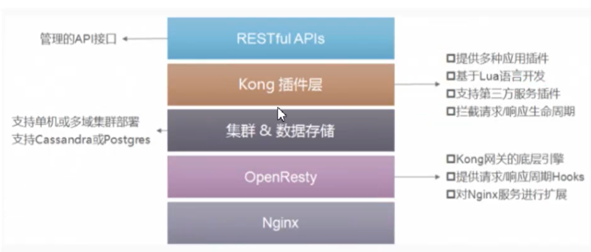

# Kong


## 基础介绍

一款基于OpenResty(Nginx+Lua模块)编写的高可用、易扩展的，由Mashape公司开源的API Gateway项目

Kong核心组件：
1. Kong Server:基于nginx的服务器，用来接收API请求
2. Apache Cassandra./PostgreSQL:用来存储操作数据
3. Kong dashboard:官方推荐UI管理工具，当然，也可以使用restfull方式管理admin api




### 安装目录


#### kong.conf
```yaml
kong.conf:

```

### kong
```yaml
kong:
    migrations:
        bootstrap:
```


## 核心内容

### Admin API
```yaml
kong:
    /certificates/{certificate name or id}/services:
    /services:
    /upstreams:
    /upstreams/{upstream host:port or id}/targets:
```

nginx动态配置


## konga

开源 Admin Web界面
- DashBoard
- Api Gateway
    - Info
    - Services
    - Routes
    - Consumers
    - Plugins
    - Upstreams
    - Certificates
- Application
    - Users
    - Connections
    - Snapshots
    - Settings


## kong原理

### SQL Table