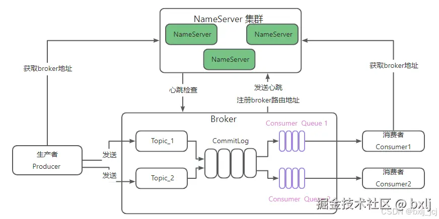

# RocketMQ


## 基础介绍

阿里开源消息队列



核心功能：
- 应用解耦
- 流量削峰
- 数据分发

待解决问题：
- 高可用
- 消息重复消费问题
- 消息丢失问题
- 消息传递顺序性
- 消息处理一致性


### 安装目录
```yaml
rocketmq:
    /benchmark:
    /bin:
        mqbroker: # 启动 Broker
        mqnamesrv: # 启动 NameServer
        mqshutdown: # 关闭脚本
            broker:
            namesrv:
        runbroker.sh: # 内部运行broker
        runserver.sh: # 内部运行name server
    /conf:
    /lib:
    README.md:
```


#### broker.conf
```yaml
broker.conf:

```


## 核心内容
```yaml

```


### Producer


### Consumer


#### Consumer Group

消费组；每一个 consumer 实例都属于一个 consumer group，每一条消息只会被同一个 consumer group 里的一个 consumer 实例消费。（不同consumer group可以同时消费同一条消息）


### Topic

区分消息的种类；一个发送者可以发送消息给一个或者多个 Topic；一个消息的接收者可以订阅一个或者多个 Topic 消息


#### Message Queue

相当于是 Topic 的分区；用于并行发送和接收消息


### Broker

暂存和传输消息


### NameServer

服务注册与发现中心
管理 Broker


## 扩展


### rocketmq-dashboard 