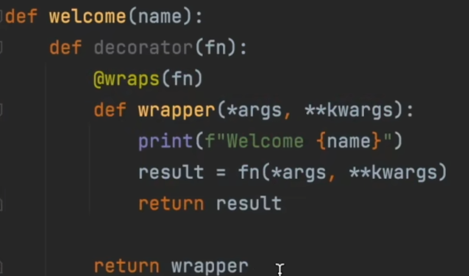
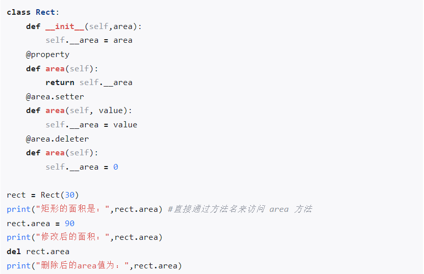

# Python

>
> `Python官方文档教程：https://docs.python.org/3/tutorial/index.html`
>
> `Python API文档：https://docs.python.org/3/library/index.html`
> ``


## 基础介绍


python标准库索引：
- abc: 抽象基类
- ast: 抽象语法树
- bisect: 二分查找
- collections: 常用数据结构
    - defaultdict:
    - deque:
    - Counter:
- csv: csv文件
- datetime: 用于处理日期和时间
- doctest: 文档测试
- http: HTTP
- importlib:
- inspect:
- itertools: 迭代器的工具
- json: JSON 数据的编码和解码
- logging: 日志
- math: 数学运算
- multiprocessing: 多进程
- os: 操作文件系统相关
    - path: 路径操作
- pathlib: 面向对象的文件路径操作库
- pdb: 调试器
- platform: 操作系统信息
- random: 随机数
- re: 正则表达式
- shutil: 高阶文件操作工具
- site:
- socket: socket通信
- sqlite3: sqlite3数据库操作
- statistics: 数值统计
- threading: 多线程
- time: 时间相关功能
- traceback: 格式化打印异常信息
- unittest: 单元测试
- urllib:


### python
```yaml
python:
    -c: # "执行一段 Python 代码（字符串）"
    -i: # "脚本执行完后进入交互模式"
    -m: # 模块执行 直接执行文件 和 执行模块之间存在区别
        pdb:
        pydoc:
        unittest: # 单元测试
            -p:
            -s:
    -u: # 不使用 I/O 缓存，适用于日志/实时输出场景
    -B:
    -O: # 启用优化模式，移除断言语句 (assert)
    -S: # 启动时不自动导入 site 模块（影响环境变量加载）
    -V:
    -X: # 调试和开发相关参数
        tracemalloc:
    --help:
    --version:
```

### pip
```yaml
pip:
    -i: # 指定镜像源
    --trusted-host: # 指定信赖主机
    check:
    config:
    download:
    freeze: # 输出已安装包（requirements format）
    hash:
    install: # 安装包
    list: # 列出已安装包
    search: # 搜索包
    show:
    uninstall:
    wheel:
```

pip镜像源
- `https://pypi.tuna.tsinghua.edu.cn/simple/`


### pdb
```yaml
pdb:
    break: # 设置断点
    clear:
    continue: # c 下一个断点
    disable: # 禁用断点
    down:
    enable:
    help:
    list: # l 列出上下附近代码片段
    longlist:
    next: # 步过
    print:
    quit: # q 退出
    return: # 运行到return前
    step: # 步入
    until:
    up: # 上下文切换
    where: # w 函数调用堆栈
```

python调试工具


## 核心内容
```yaml
std:
    abc: # 抽象类
        ABC: # 抽象父类
        ABCMeta: # 标注为抽象类
        @abstractmethod: # 抽象方法
    argparse: # 命令行解析工具
        ArgumentParser:
            description:
            add_argument(): # 添加命令行参数
                action:
                default: # 默认值
                help:
                type:
            parse_args(): # 参数解析返回args
    array: # 相同元素数组
        array: # 支持切片
            typecode: # 元素类型
            append(): # 追加元素
            extend():
            insert():
            pop():
            remove():
            reverse():
            tobytes():
            tolist(): # 转换为list
    asyncio: # 异步
        Barrier:
        BoundedSemaphore:
        CancelledError: # 协程任务取消异常
        Condition:
        Event: # 异步事件等待，顺序控制
            set(): # 事件触发
            wait():
        Future: # Task父类，可存储结果，通常用于task内部，可await
            add_done_callback():
            cancel():
            done():
            exception():
            result():
            set_exception():
            set_result():
        Queue: # 异步队列，协程通信
            get():
            put():
        Runner:
        Semaphore: # 异步信号量，并发量控制，配合async with异步上下文使用
        Task: # 异步协程任务对象，Future子类
            add_done_callback(): # 成功回调
            cancel(): # 取消任务
            done():
            exception():
            result(): # 同步获取结果
            set_exception():
            set_result():
        TaskGroup:
        @coroutine: # 装饰器定义协程函数
        all_tasks():
        as_completed():
        create_future(): # 创建Task
        create_task(): # 根据co对象创建task
        current_task():
        ensure_future():
        gather(): # 并行执行多个任务，不定量参数，等待多个协程完成
        get_event_loop(): # 获取当前线程的事件循环对象，手动管理事件循环
            run_forever():
            run_until_complete():
        get_running_loop(): # 获取当前线程的事件循环对象，线程和事件循环是一一绑定的
            close(): # 关闭事件循环
            create_future():
            create_task(): # 根据co对象创建task
            run_forever():
            run_until_complete(): # 运行所有任务
            stop():
        new_event_loop(): # 新建事件循环
        run(): # 运行一个协程/任务，等待完成，内置事件循环（每次创建、结束销毁）
        set_event_loop(): # 设置当前线程的事件循环
        sleep(): # 协程睡眠
        to_thread(): # 异步线程包装，避免阻塞事件循环
        wait(): # 多个任务等待，list列表，多个task包装成一个task
        wait_for(): # 限时等待
    ast: # 抽象语法树，提供了对 Python 代码的解析、处理和转换功能，可以用来实现源代码分析、代码生成、动态执行等操作
        Add: # 加法运算符
        Assign: # 赋值操作
        BinOp: # 二元操作，如加法、减法等
        Constant: # 常量值，如数字、字符串等
        Load: # 读取变量
        Module: # 模块
        Name: # 变量名或函数名
        NodeVisitor: # 自定义节点访问器
            generic_visit(): # 继续遍历子节点
            visit_Assign():
        Store: # 写入变量
        Sub:
        compile(): # 编译ast，常配合exec使用
        dump():
        parse():
        walk():
    base64: # base64编码
        b64decode():
        b64encode():
    bisect: # 二分查找工具
        bisect_left(): # 找到第一个 >= x 的位置
        bisect_right(): # 找到第一个 > x 的位置
        insort_left(): # 插入
        insort_right():
    builtins:
        __builtins__:
        __debug__:
        __doc__:
        __file__:
        __name__:
        __package__:
        Enum:
        Exceptioin: # 异常基类
            args: # 参数
            with_traceback():
        StopIteration: # 停止迭代异常
        ValueError:
        bool:
        bytearray: # 可变字节数组
        bytes: # 不可变字节数组
            count():
            decode(): # 解码
            find():
            fromhex():
            hex(): # 十六进制字符串
        complex:
        dict: # 字典，访问一个不存在的键时，会抛出 KeyError 异常
            clear():
            copy():
            get():
            items(): # 获取所有k、v键值对
            keys():
            pop():
            popitem():
            update():
            values():
        float:
        frozenset: # 不可变集合
        int:
        list: # 列表
            append(): # 添加元素
            clear():
            copy():
            count():
            extend():
            index():
            insert():
            pop():
            remove():
            reverse():
            sort(): # 排序
        object:
        set:
            add():
            clear():
            difference():
            intersection():
            issubset():
            pop():
            remove():
            update():
        slice:
        str: # 字符串
            encode(): # 编码
            format(): # 格式化字符串
            isalpha(): # 字符判断
            join(): # 以指定字符串拼接数组
            replace():
            split(): # 字符串分隔
            startswith():
            strip(): # 剔除空白符
            title(): # 首字母大写转换
            upper(): # 转大写
        tuple:
            count():
            index():
        @classmethod:
        @property:
            @fdel:
            @fdoc:
            @fget:
            @fset:
            @deleter:
            @setter:
        @staticmethod:
        abs(): # 取绝对值
        all(): # 判定是否全部为True
        any(): # 判定是否存在True
        ascii(): # 转ascii码
        bin(): # 转二进制
        breakpoint(): # 断点debugger
        callable(): # 判定对象是否可以调用
        chr(): # 转字符
        delattr(): # 反射，删除属性
        dir(): # 获取对象属性、方法
        divmod(): # 整除取余
        enumerate(): # 带索引迭代
        eval(): # 执行字符串表达式，有返回值
        exce(): # 执行字符串脚本，无返回值
        exit(): # 程序退出
        filter(): # 元素过滤
        format():
        getattr(): # 反射，访问属性
        globals():
        hasattr(): # 反射，对象属性存在判断
        help(): # 获取帮助信息
        hex(): # 转16进制
        id(): # 获取内存地址
        input(): # 输入
        isinstance(): # 实例化对象判断
        issubclass(): # 子类判断
        iter(): # 可迭代对象转迭代器
        len():
        max():
        next(): # 取出迭代器下一个元素
        open(): # 打开文件
            encoding: # 编码
            mode: # 打开模式
                r: # 
                w:
                x:
                a: # 添加、写
                b: # 二进制模式
                t: # 文本模式
            --- # file对象，可迭代遍历每行
            close(): # 关闭文件
            flush(): # 刷新缓冲区 
            read(): # 读取（会移动光标）
            readline(): # 读取一行
            readlines():
            seek(): # 移动光标
            tell(): # 光标位置
            write(): # 写入内容（缓冲区）
        print(): # 控制台输出
        repr(): # 可见字符显示
        setattr(): # 反射，设置属性
        type(): # 获取对象的类型、动态创建新类
            class_attr:
        zip():
    bz2:
    calendar: # 日历
        SUNDAY:
        HTMLCalendar:
            formatmonth():
        TextCalendar: # 文本日历
            formatmonth(): # 
        calendar(): # 日历类
        isleap():
        leapdays():
        month():
        monthcalendar():
        monthrange():
        setfirstweekday():
        weekday():
    cmath:
    collections: # 集合
        defaultdict: # 一个带有默认值的字典，（当你访问一个不存在的键时，defaultdict 会自动为你创建该键，并赋予一个默认值，而不会抛出 KeyError 异常），支持自定义默认值函数
            int:
            list:
            set:
        deque: # 双端队列
            append():
            appendleft():
            pop():
            popleft():
        namedtuple: # 结构化元组，轻量版类，支持自定义索引key
            _asdict():
            _fields():
            _replace():
        Coroutine: # 协程
        Counter: # 计数器
            elements(): # 返回一个迭代器，产生计数大于 0 的所有元素，元素会根据它们的计数重复输出
            most_common(): # 输出出现次数最多的n个
            subtract():
            update():
        Generator: # 生成器
        Iterable: # 可迭代对象
        OrderedDict: # 保持插入顺序的字典
        UserDict:
        UserList:
        UserString:
    concurrent: # 并发库
        futures: # 异步
            Executor: # 执行器
                map(): # 直接运行，等待所有返回结果
                shutdown(): # 关闭
                    wait: # 等待所有任务执行完毕
                submit():
            Future: # 异步结果对象
                cancel(): # 取消任务
                done(): # 检查是否完成
                result(): # 阻塞获取结果
                    timeout: # 超时事件
                exception():
                add_done_callback():
                set_exception():
                set_result():
                set_running_or_notify_cancel():
            ProcessPoolExecutor: # 进程池
                map():
            ThreadPoolExecutor: # 线程池
                max_workers:
                submit(): # 提交执行任务Task，返回future
            as_completed(): # Future完成迭代，可遍历future结果，谁先完成就先返回谁(Future)
            wait(): # 所有Future等待
                return_when: # 指定等待的条件
        shared_memory: # 共享内存
            ShareableList:
            SharedMemory: # 共享内存
            SharedMemoryManager:
    configparser: # ini配置文件解析
        ConfigParser: # ini配置文件解析(段落 -> 选项)
            add_section(): # 添加节点
            get(): # 获取value值
            has_section():
            items(): # 根据名称获取指定段落的k-v
            read(): # 读入配置
            remove_option():
            remove_section():
            sections(): # ini段落
            set(): # 设置value值
            write(): # 写出配置
    contextlib: # 上下文管理
        @asynccontextmanager:
        @contextmanager:
    copy: # 拷贝
        deepcopy(): # 深拷贝
    csv:
    dataclasses:
        @dataclass(): # 数据类dataclass
            order:
            __post_init():
        asdict():
        field():
            default_factory:
    datetime: # 日期相关
        date: # 日期
            fromtimestamp(): # 时间戳转换date
            timetuple(): # 获取时间元组struct_time
            today():
        datetime: # 日期时间
            day:
            hour:
            minute:
            month:
            second:
            year:
            fromtimestamp(): # 时间戳转换datetime
            now(): # 当前时间
            replace(): # 时间替换
                hour:
                minute:
                month:
                year:
            strftime(): # 格式化时间
                %Y: # 年
                %m: # 月
                %d: # 日
                %H: # 时
                %M: # 分
                %S: # 秒
            strptime(): # 日期事件解析
            timestamp(): # 时间戳
            timetuple(): 
            today(): # 今天
            utcfromtimestamp(): # UTC 时间戳转换
        time: # 时间
        timedelta: # 时间间隔
            days:
            hours:
            weeks:
            total_seconds(): # 总共秒数
        timezone: # 时区
            utc:
    decimal:
    difflib:
    enum: # 枚举
        Enum: # 枚举基类
        Flag: # 按位枚举
        IntFlag:
        IntEnum:
        StrEnum:
        unique:
        auto(): # 自动枚举值
    fnmatch:
    fractions:
    ftplib:
    functools: # 函数工具库
        @lru_cache(): # 将函数的参数 做哈希处理，作为 key，将函数返回值 存储到一个 dict-like 的结构中，如果缓存满了（达到了 maxsize），就淘汰最近最少使用的项
        @reduce(): # 迭代计数
        @wraps(): # 函数包装(常用于高阶函数装饰器).可以将原函数的元数据（如 __name__ 和 __doc__）复制到包装函数上
    gc:
    glob: # 文件索引
        escape():
        glob():
            recursive():
    gzip:
    hashlib: # 哈希
        md5(): # md5加密
            digest(): # 加密
            hexdigest(): # 16进制加密
            update(): # 添加字节
        new():
        sha1():
            digest(): # 加密
            hexdigest(): # 16进制加密
            update():
        sha224():
        sha256():
    heapq: # 堆（heap）操作工具，优先队列，默认实现的是 最小堆
        heapify(): # 将列表变成最小堆
        heappop():
        heappush():
        heappushpop():
        heapreplace():
        nlargest(): # 前k大
        nsmallest(): # 前k小
    html:
    http:
        client:
            HTTPResponse: # http响应
                reason:
                status:
                version:
                fileno():
                getheader():
                getheaders():
                geturl():
                read():
        cookies:
        server:
    importlib: # 模块导入
        util:
        import_module(): # 动态导入模块
        reload():
    inspect: # 反射信息
        Parameter:
            default:
            kind:
                POSITIONAL_ONLY: # 位置参数 x
                VAR_POSITIONAL: # 可变位置参数 *args
                KEYWORD_ONLY: # 关键字参数 y=10
                VAR_KEYWORD: # 可变关键字参数 **kwargs
            name:
        Signature:
        currentframe(): # 当前执行的栈帧对象
        isclass():
        isfunction(): # 
        ismethod(): # 
        getdoc(): # 获取文档字符串
        getmembers(): # 获取类所有成员  
        getsource(): # 获取源代码
        signature(): # 获取方法签名
            parameters: # 参数列表
        stack(): # 获取堆栈信息
    io: # 内建I/O模块
        BytesIO: # 二进制流
        StringIO: # 字符串流
            getvalue():
            seek():
            write():
    ipaddress: #  IP地址操作
        IPv4Address: # ipv4
            broadcast_address: # 广播地址
            is_private: # 私有地址
            netmask: # 子网掩码
            network_address: # 网络地址
            num_addresses: # 主机数
            hosts(): # 所有主机地址
            subnets(): # 子网划分
        IPv6Address: # ipv6
        ip_address():
            version:
    itertools: # 迭代工具库
        count: # 计数器，可迭代，无限
            start:
        chain(): # 合并
        permutations(): # 
    json: # JSON
        dump(): # json序列化
        dumps(): 
        load(): # json反序列化
        loads():
    logging: # 日志库（Logger、Handler、Formatter、Filter）
        config:
            fileConfig():
        handlers:
            RotatingFileHandler: # 循环覆盖日志
        DEBUG:
        INFO:
        FileHandler: # 日志处理器Handler
            addFilter(): # 添加日志过滤器
            setFormatter(): # 添加日志格式化器
            setLevel():
        Filter: # 日志过滤器
            filter():
        Formatter: # 日志格式化器Formatter
        Handler:
        StreamHandler: # 控制台输出
            setFormatter():
            setLevel():
        basicConfig(): # 日志基础配置
            filename:
            filemode:
            format: # 日志格式化
                asctime: # 时间
                filename: # 文件名
                funcName:
                levelname:
                lineno:
                message: # 日志内容
                pathname:
                process:
                thread:
                threadName:
            level:
        critical():
        debug():
        error():
        getLogger(): # 返回日志记录器Logger
            addHandler(): # 添加日志处理器
            setLevel():
        info():
        warning():
    lzma:
    marshal: # 内置对象序列化
        dump(): # 序列化
        dumps(): 
        load(): # 反序列化
        loads():
    math: # 数学库
        pi:
        sqrt(): # 平方根
    multiprocessing: # 多进程
        pool: # 进程池
            AsyncResult: # 异步结果
                get():
            Pool: # 进程池
                processes: # 进程数
                apply():
                apply_async(): # 执行方法，返回AsyncResult异步结果
                    args:
                close():
                imap():
                imap_unordered():
                join():
                map():
                map_async():
        Process: # 进程
            target:
            join():
            start():
        Queue: # 进程通信队列
        Value: # 共享内存
            value:
        cpu_count(): # cpu个数
    numbers:
    operator: # 运算符
        attrgetter:
        itemgetter:
    os: # 操作系统相关（文件、路径）
        path: # 路径操作
            abspath(): # 绝对路径
            basename(): # 基础文件名
            dirname(): # 获取目录名
            exists(): # 文件存在
            getatime():
            getsize(): # 获取文件大小
            isabs(): # 绝对路径判断
            isdir(): # 是否为目录
            isfile(): # 文件判断
            join(): # 路径合并
            relpath():
            split(): # 路径分隔（dirname、basename）
            splitext():
        curdir:
        environ: # 环境变量
            setdefault():
        linesep: # 行结束符
        name:
        pardir:
        chdir(): # 修改当前工作目录
        chmod():
        get_terminal_size():
        getcwd(): # 获取当前工作路径
        getcwdb():
        getenv(): # 获取环境变量
        kill(): # 结束进程
        listdir(): # 列出目录列表
        makedirs(): # 创建目录
        mkdir():
        rmdir(): # 删除目录
        remove(): # 删除文件
        removedirs(): # 删除多个目录
        rename(): # 文件重命名（移动文件）
        replace():
        stat(): # 获取文件属性
        system(): # 执行shell命令
        walk(): # 文件浏览（dfs）, foldername, subfolders, filenames
    pathlib: # 面向对象的文件路径操作
        Path: # 路径对象
            name: # 文件名
            parent: # 父目录
            stem: # 仅文件名
            suffix:
            chmod():
            exists():
            is_dir():
            is_file():
            is_symlink():
            iterdir(): # 目录迭代
            joinpath():
            mkdir():
            read_bytes():
            read_text(): # 读取文本内容
            rglob(): # 文件匹配
            rmdir():
            samefile():
            stat(): 
            write_bytes():
            write_text():
            unlink():
    pdb: # Python Debugger调试器
        set_trace(): # 进入断点
    pickle: # python序列化
        dump(): # 序列化到文件
        dumps(): # 序列化
        load(): # 从文件中反序列化
        loads(): # 反序列化
    platform:
    pydoc:
    queue: # 队列
        Queue: # 线程通信队列
    random: # 随机数
        SystemRandom:
        choice(): # 随机返回一个字符
        randint(): # 随机整数
        randrange():
        random(): # 随机浮点数
        sample(): # 采样（随机返回多个字符）
        shuffle(): # 随机排列
    re: # 正则表达式
        I: # 忽略大小写
        M: # 多行模式
        S: # . 匹配特殊字符
        X:
        compile(): # 正则编译
            match():
            search():
        findall(): # 查找所有
        fullmatch(): # 匹配所有
        match(): # 匹配(从头匹配)
        search(): # 搜索
        split(): # 分隔
        sub(): # 字符串替换
            (?P<name>...): # 分组匹配命名
            \d: # 数字
            \s: # 空白符
            \w: # 字母数字字符
            \A: # 字符开头
            \W:
            group():
            groupdict():
            groups():
    readline: # 交互式命令行体验增强
        get_current_history_length():
        parse_and_bind():
        read_history_file():
        set_completer(): # 命令补全
        write_history_file():
    select:
    shutil: # 文件操作工具类
        copy(): # 文件拷贝(文件、权限)
        copy2(): # 文件拷贝(文件、状态)
        copyfile():
        copyfileobj():
        copymode():
        copystat():
        copytree(): # 递归拷贝文件夹
        make_archive(): # 压缩包生成
            base_name:
            format:
                zip:
            owner:
            root_dir: # 压缩根目录
        move(): # 移动文件
        rmtree(): # 递归删除文件
        uppack_archive(): # 解压压缩包
            filename: # 解压文件名
            extract_dir: # 解压目录
            format: # 解压格式
    site: # 添加第三方库的路径到 sys.path、处理 .pth 文件、设置默认编码（早期版本）、运行用户或全局的 sitecustomize.py / usercustomize.py
        getsitepackages(): # 查看全局 site-packages 路径
        getusersitepackages(): # 查看用户级 site-packages 路径
    socket: # socket通信
        AF_INET:
        SOCK_DGRAM: # UDP协议
        SOCK_STREAM: # 流式协议TCP
        socket():        
            fd:
            type: # socket类型
            laddr:
            raddr:
            accept(): # 接收socket
            connect(): # 建立连接
            bind(): # socket绑定
            listen(): # socket监听
            readfrom():
            recv(): # 接收响应(byte字节)
            send(): # 发送请求
            sendto():
    socketserver:
    sqlite3: # Connection、Cursor
        connect(): # 连接数据库 返回连接Connection
            :memory: # 内存数据库
            close():
            commit(): # 提交执行
            cursor(): # 获取Cursor游标对象
                rowcount: # 获取受影响的行数
                execute(): # 执行sql语句 
                executemany():
                fetchall(): # 获取所有数据
    ssl:
        _create_unverified_context():
        create_default_context():
            cafile:
    statistics: # 数值统计
        mean():
        median():
    string: # 字符串
        ascii_lowercase:
        digits: # 数字
    struct:
    sys: # 程序参数相关
        _MEIPASS: # pyinstaller 打包后资源路径
        argv: # 程序参数
        builtin_module_names:
        copyright:
        maxint:
        maxsize:
        meta_path:
        modules: # 导入的模块
        path: # 模块搜索路径 PATH
        path_hooks:
        platform: # 操作系统平台
        stderr: # 标准异常
        stdin: # 标准输入
            read():
            readline():
        stdout: # 标准输出流
            write():
        version: # python版本
        exc_info():
        exit(): # 程序退出
        getdefaultencoding(): # 获取解释器默认编码
        getfilesystemencoding(): # 获取文件默认编码
        getrecursionlimit(): # 获取最大递归层数
        getsizeof(): # 获取对象内存大小
        setdefaultencoding():
        setrecursionlimit(): # 设置最大递归层数
    telnetlib:
    tempfile:
    textwrap:
    threading: # 多线程
        Barrie: # 线程屏障,每一轮等满后，屏障会自动 reset（重置）
            broken:
            abort():
            reset():
            wait(): # 就绪等待， 会返回一个编号（0~N-1），编号为 0 的线程是第一个出 barrier 的线程
        Condition: # 条件变量，控制执行顺序，基于锁机制，等待唤醒机制，可使用上下文管理
            acquire(): # 获取锁
            notify(): # 唤醒一个其它wait等待的 条件变量
            notify_all():
            release(): # 释放
            wait(): # 等待
        Event: # 事件，等待唤醒机制
            clear():
            set():
            wait():
        Lock:
        RLock:
        Semaphore: # 信号量
            acquire():
            release():
        Thread: # 线程对象
            name: # 线程名
            getName():
            is_alive():
            isDaemon():
            join(): # 阻塞运行
            run(): # 主运行方法
            setDaemon():
            start(): # 开始运行
        Timer:
        activeCount():
        current_thread(): # 当前线程对象
        enumerate():
        get_ident():
        local(): # ThreadLocal
    time: # 时间戳相关
        struct_time: # 时间元组
            tm_mday:
            tm_mon:
            tm_year:
        asctime(): # 字符显示时间（struct_time转换）
        ctime(): # 时间戳转asctime
        gmtime(): # 获取格林威治时间（0时区）
        localtime(): # 获取本地时间 struct_time
        mktime(): # 标准时间转时间戳
        perf_counter(): # 执行计数（秒）
        sleep(): # 线程睡眠，秒
        strftime(): # 格式化显示时间
        strptime(): # 格式化转换时间
            %d: # 日
            %m: # 月
            %p: # AM PM
            %z: # 时区
            %H: # 时
            %M: # 分
            %Y: # 年
        time(): # 获取时间戳（1970.1.1）
        time_ns(): # 纳秒时间戳
    tkinter:
        colorchooser:
        font:
        messagebox: # 消息窗口
            askokcancel():
            showerror():
            showinfo():
            showwarning():
        ttk:
            Combobox:
                textvariable:
                values:
        Button:
            command: # 函数绑定
            font:
            text:
        CheckButton:
            onvalue:
            text:
            variable:
        Entry: # 输入框组件
            font:
            state:
            textvariable: # 绑定变量
            width:
        IntVar: # 整型变量
        Label: # 标签组件
            bg:
            fg: # 前景色
            font:
            text:
            grid(): # 网格布局
            pack(): # 填充布局
            place(): # 自定义布局（位置）
        ListBox:
            insert():
        Menu: # 菜单组件（可嵌套）
            tearoff:
            add_cascade():
                label: # 菜单标签
            add_command(): # 子功能标签
        RadioButton: # 单选按钮
            text:
            value:
            variable:
        StringVar: # 字符串变量（组件值绑定）
            get():
            set():
        Tk: # 窗口程序
            attributes(): # 窗口属性
                -alpha:
                -topmost:
            config():
                menu: # 菜单栏
            configure(): # 窗口配置 
                bg: # 窗口背景颜色
            destroy(): # 窗口销毁
            geometry(): # 窗口大小（位置）
            iconbitmap(): # 窗口图标
            mainloop(): # 开启事件循环
            maxsize(): # 屏幕尺寸
            protocol(): # 绑定钩子函数
            resizable(): # 屏幕缩放
            title(): # 窗口标题
        TopLevel: # 顶层窗口（内层窗口）
            focus_set():
    tomllib:
        load():
    tracemalloc: # 内存分配跟踪
        get_traced_memory():
        start():
        stop():
    types: # 类型类
        FunctionType:
        MethodType: # 方法类型
    typing: # 类型注解
        Annotated: # 复合注解信息
        Any:
        Callable:
        ClassVar: # 类变量（dataclass）
        Dict: # 字典
        List: # 列表
        Literal: # 字面量
        Mapping:
        NamedTuple:
        NewType: # 自定义类型
        NoReturn:
        Optional: # 可选参数
        Sequence: # 只读列表
        Set: # 集合
        Tuple: # 元组
        TypeAlias: # 类型别名
        TypeVar: # 类型变量T
        TypedDict:
        Union: # 联合类型
    unicodedata:
    unittest: # 单元测试 test*.py
        mock:
            MagicMock:
            Mock:
                get:
                    return_value:
                get():
            pacth():
                return_value:
                    json:
                        return_value:
                    status_code:
        TestCase: # 测试用例类
            assertEqual():
                msg:
            assertFalse():
            assertIsInstance():
            assertRaises(): # 测试异常抛出（with）
            assertTrue():
            setUp(): # 测试运行前钩子，每个
            setUpClass(): # 总的运行前钩子
            tearDown(): # 测试运行结束前钩子，每个
            tearDownClass(): # 总的运行后钩子
        @expectedFailure():
        @skip():
        @skipIf(): # 跳过测试
        @skipUnless():
        main(): # 测试运行（自动扫描）
        setUpModule():
        skipTest():
        subTest(): # 子测试
        tearDownModule():
    urllib: # 网络请求
        error:
            HTTPError: # URLError子类
            URLError:
        parse: # 解析模块
            urlencode(): # url编码
                encoding:
            urldecode():
        request: # 请求模块
            ProxyHandler:
                proxies:
                    http: # http代理地址
            Request: # Request请求对象
                headers: # 请求头
                method: # 请求方法
                url:
            build_opener(): # 构建自定义opener（传入handler）
                handlers:
                --- # 返回opener对象
                open():
            urlopen(): # 发送request请求，响应http.client.HTTPResponse
                context: # SSL
                data: # 请求体
            urlretrieve(): # 文件下载
        response:
    uuid: # UUID
        UUID:
        uuid1(): # 时间戳生成
        uuid3(): # MD5哈希生成
        uuid4(): # 随机数生成
        uuid5(): # 名字生成
    venv: # 虚拟环境模块
    warnings:
    weakref:
        WeakKeyDictionary:
        WeakSet:
        WeakValueDictionary: # 弱引用字典
        ref():
    wsgiref:
        simple_server:
            make_server():
                serve_forever():
    xml: # xml操作
        dom:
            minidom:
                parseString():
                    documentElement:
                    tagName:
                    getElementsByTagName():
                    toprettyxml():
        etree:
            ElementTree: # 标签树类 （根标签）（可迭代遍历）
                fromstring(): # 解析xml字符串
                find():
                findall():
                findtext():
                getroot(): # 获取根标签
                iter():
                makeelement(): # 创建标签元素
                parse(): # 解析文件
                tostring(): # xml元素转字符串
                write(): # xml内容写出
                XML():
        parsers:
        sax: # 提供事件驱动的 API，xml解析器
            ContentHandler:
                characters():
                endElement():
                startElement():
            make_parser():
                setContentHandler():
        Element: # 标签元素类
            attrib:
            tag: # 标签名
            text: # 标签文本内容
            append(): # 添加子标签
            extend():
            find():
            findall():
            findtext():
            getchildren():
            getiterator():
            insert():
            iter(): # 迭代指定标签
            iterfind():
            itertext():
            remove(): # 删除标签
            set(): # 修改标签attr
        SubElement: # 创建子标签
    zlib:
    zipfile: # zip文件压缩
        ZIP_DEFLATED:
        ZipFile:
            close():
            extractall(): # 解压
                path:
            write(): # 添加文件
    zoneinfo:
```

### 数据类型
```yaml
DataTypes:
    bool:
    bytes:
    complex: # 复数
    coroutine: # 协程对象
    float:
    function: # 函数
    generator: # 生成器
    int: # 整数
    list: # 列表
    str: # 字符串
    tuple: # 
    Enum:
    None:

BuiltinVar:
    __file__: # 当前文件名
    __name__: # 当前模块名（执行模块为__main__）
```

可选类型：`type | None`
类型别名：`typing.TypeAlias`


#### Bytes
```python
# 字节数据声明
b = b"hello"

# 构造函数声明
b2 = bytes([72, 101, 108, 108, 111])

# 可变字节数组
b = bytearray(b"hello")
b[0] = 72  # 修改第一个字节
```

不可变的二进制数据
使用字符串切片、拼接实现字符串修改


#### Str
```python
# 多行字符串
str = """
    多行字符串内容
"""

# 模板字符串
str = "%s" % xxx;
str = f"{ var }"

# 原串
str = r"xxx"

# 字节串
str = b"xxx"
```


不可变字符串


#### Tuple
```python
# 元组字面量声明
t1 = (1, 2, 3)
t2 = ("hello", True, 3.14)

# 构造方法声明
t6 = tuple([1, 2, 3])
```

不可变序列
支持切片索引、解构


#### List
```python
# 字面量声明
lst = [1, 2, 3, "hello", True]

# 构造声明
lst = list((1, 2, 3))  # 从元组转换


# 列表推导式
lst = [x for x in range(10) if x % 2 == 0]
```

可变序列
支持切片索引、


#### Set
```python
# 字面量声明
s = {1, 2, 3, 4}

# 构造声明
s = set([1, 2, 3, 3, 2])
```

无序、不重复 的数据结构
支持集合运算、


#### Dict
```python
# 字面量声明
d = {"name": "Alice", "age": 25}

# 构造声明
d = dict(name="Alice", age=25)
```

字典K-V映射


#### Enum
```python
class Color(Enum):
    RED = 1
    GREEN = 2
    BLUE = 3
    def describe(self):
        return f"{self.name} ({self.value})"

# 带构造枚举
class Status(Enum):
    SUCCESS = (200, "Operation successful")
    NOT_FOUND = (404, "Resource not found")
    SERVER_ERROR = (500, "Internal server error")

    def __init__(self, code, msg):
        self.code = code
        self.msg = msg
```

Enum枚举


支持名称索引、值索引、遍历
auto()自动赋值


### 控制流程
```yaml
Control Flow:
    //: # 整除
    as: # 别名
    del: # 删除变量
    in:
    is:
    pass: # 代码省略
    raise:
    for ... else:
    for ... in:
        enumerate(): # 带索引遍历
        range(): # 数值遍历（可逆序）
        reversed(): # 逆序遍历
    if ... elif ... else:
    match ... case if ...: # switch case 进阶版
    try ... except ... finally:
    while ... else:
        break:
        continue:
    with ... as:
```

列表推导式、字典推导式、集合推导式

参数解构：`*args`、`**kwargs`


#### Exception
```python
# 异常捕获
try:
    ...
except Exception as xxx:
    ...
else:
    ...
finally:
    ... 

# 自定义异常
class MyCustomError(Exception):
    def __init__(self, message):
        super().__init__(message)
        self.message = message

# 使用自定义异常
try:
    raise MyCustomError("Something went wrong!")
except MyCustomError as e:
    print(f"Custom Error: {e}")
```


异常处理


#### Context Manager

with语句（类中），`__enter__()`、`__exit__()`
`@contextmanager`+生成器函数


上下文管理可以与装饰器结合起来
```python
@contextmanager
def change_dir(path: str):
    old_path = os.getcwd()
    os.chdir(path)
    yield old_path  # yield之前为__enter__()内部实现，yield返回值为__enter__()返回值
    os.chdir(old_path) # yield之后为__exit__()内部实现

with change_dir("/xxx") as old_path:
    pass
```


#### Doc String
```python
def multiply(a, b):
    """
    Multiplies two numbers and returns the result.

    :param a: The first number to multiply.
    :type a: int
    :param b: The second number to multiply.
    :type b: int
    :return: The product of a and b.
    :rtype: int
    :raises ValueError: If any parameter is not an integer.
    """
    if not isinstance(a, int) or not isinstance(b, int):
        raise ValueError("Both parameters must be integers.")
    return a * b
```

rst: reStructuredText

文档字符串


### 函数


#### Lambda
```python
add = lambda a, b: a+b

add(1, 2)
```

匿名函数


#### Generator
```python
def simple_generator():
    yield 1
    yield 2
    yield 3

gen = simple_generator() # 获取生成器对象
print(next(gen))  # 输出: 1
print(next(gen))  # 输出: 2
print(gen.__next__())  # 输出: 3
next(gen)  # 如果再调用 next(gen)，将抛出 StopIteration 异常


def simple_coroutine():
    print("Start coroutine")
    x = yield 1
    print(f"Received: {x}")
    y = yield 2
    print(f"Received: {y}")

gen = simple_coroutine() # 获取生成器对象
# 首次调用生成器时，必须传递 None，因为生成器还没有遇到任何 yield 表达式。传其他值会报错
print(gen.send(None)) # 输出: Start coroutine, 然后输出: 1
print(gen.send(10))  # 输出: Received: 10, 然后输出: 2
print(gen.send(20))  # 输出: Received: 20, 然后生成器结束，抛出 StopIteration 异常
```

简化迭代器对象的创建（自动创建`__iter__()`、`__next__()`）

带`yield`函数、生成器表达式：`my_gen = (i*i for i in [1, 2, 3, 4, 5])`

每一次next()、send()都执行到yield（之前的语句）为止、第一次send()无效（第一次传参应该是函数传参）

带yield返回值的函数


#### Decorator
```python
def count_calls(message="Function called"):

    def decorator(func):
        count = 0

        @functools.wraps(func)  # 保持原函数的元数据
        def wrapper(*args, **kwargs):
            nonlocal count
            count += 1
            print(f"{message}: {count} times")
            return func(*args, **kwargs)
        return wrapper
    return decorator

@count_calls("add function called")
def add(a, b):
    return a + b
```

高阶函数
接收函数作为参数、返回一个新函数，@执行




一般装饰器函数两层、带参数装饰器三层


#### Generaic
```python
from typing import TypeVar, List

# 定义泛型类型参数 TypeVar
T = TypeVar('T')

# 泛型函数声明
def first_item(items: List[T]) -> T:
    return items[0]
```


函数泛型
函数的泛型支持可以通过 类型提示（Type Hinting）来实现，特别是借助于 typing 模块的 泛型类型


### 面向对象
```python
class Person:
    # 类变量
    species = "Homo sapiens"

    # 构造函数，初始化实例对象的属性
    def __init__(self, name, age):
        # 实例变量
        self.name = name
        self.age = age

    # 实例方法
    def greet(self):
        return f"Hello, my name is {self.name} and I am {self.age} years old."

    # 类方法
    @classmethod
    def car_count(cls):
        return f"species: {cls.species}"

    # 静态方法
    @staticmethod
    def fuel_efficiency(miles, gallons):
        return miles / gallons
        
# 创建类的实例
person1 = Person("Alice", 30)

# 访问实例方法
print(person1.greet())  # 输出：Hello, my name is Alice and I am 30 years old. 
```

Class为type类型的对象实例，基类为object
object为type类型的对象实例，没有基类
type为type自身类型的对象实例，基类为object
（type是type，object也是type，class也是type；type继承自object，class继承自object,object没有继承）

`class = type(classname, superclass, attributedict)`

- type为对象的顶点，所有对象都创建自type。
- object为类继承的顶点，所有类都继承自object。


- `__new__`: 负责创建对象，返回实例。
- `__init__`: 负责初始化对象，接收 self 进行赋值等初始化操作。


#### Property
```python
class Square:
    def __init__(self, side_length):
        self._side_length = side_length

    @property
    def side_length(self):
        return self._side_length

    @side_length.setter
    def side_length(self, value):
        if value <= 0:
            raise ValueError("Side length must be positive")
        self._side_length = value

    @side_length.deleter
    def side_length(self):
        print("Deleting side length...")
        del self._side_length

# 创建 Square 实例
square = Square(4)

# 访问属性
print(square.side_length)  # 输出：4

# 删除属性
del square.side_length  # 输出：Deleting side length...
```

实例属性、类属性、@property装饰器
实例属性可动态添加
私有属性：`__xxx`双下滑线开头的变量


#### Extends

继承


##### Class Property

类属性


通过类、类实例对象访问类属性
类对象无法修改类变量的值，通过类对象对类变量赋值，只会修改自己对象中的变量值

#### Method
```yaml
Method:
    __class__: # 类实例获取类对象
    __dict__: # 类、实例 属性、方法字典
    __match_args__: # match语句位置参数
    __name__:
    __del__(): # 析构方法
    __delattr__(): # 删除属性
    __delete__():
    __dict__(): # 查看类属性字典
    __dir__(): # 查看类方法、属性名称
    __enter__(): # 上下文管理（进入），返回值为with接收值
    __exit__(): # 上下文管理（退出），可进行异常处理
        exc_type:
        exc_value:
        traceback:
    __get__():
    __getattr__(): # 访问属性，且属性不存在时
    __getattribute__(): # 属性访问拦截，设置了就会拦截属性访问
    __getitem__():
    __init__(): # 构造方法，初始化类的实例
    __iter__():
    __next__():
    __new__(): # 实例化类时调用，(cls, *arg, **kwargs)，最顶层走的是object.__new__()
    __repr__(): # 类对象打印信息
    __set__():
    __setattr__(): # 属性修改拦截
    __str__():
    super():
```

类中方法：
- 实例方法
- 魔术方法
- 类方法
- 静态方法


##### Magic Method

魔术方法


##### Class Method

类方法：`@classmethod`，默认传入cls类变量


##### Static Method

静态方法：`@staticmethod`，无默认传入


#### Decorator
```yaml
装饰器:
    @classmethod:
    @property: # 属性
    @staticmethod:
```




##### Class Decorator
```python
def with_prefix(prefix: str):
    def decorator(cls):
        class PrefixedClass(cls):
            def __init__(self, name: str):
                self.name = f"{prefix} {name}"
        
        return PrefixedClass
    return decorator

@with_prefix("Mr.")
class Person:
    def __init__(self, name: str):
        self.name = name

    def __repr__(self):
        return f"Person(name={self.name})"

# 创建实例
person = Person("John")
print(person)  # 输出：Person(name=Mr. John)
```

类装饰器
可修改类的行为


##### Property Decorator
```python
def cache_property(func):
    """缓存属性的值"""
    def wrapper(self):  # 传入self
        if not hasattr(self, '_cached_' + func.__name__):
            value = func(self)
            setattr(self, '_cached_' + func.__name__, value)
        return getattr(self, '_cached_' + func.__name__)
    return wrapper

class Circle:
    def __init__(self, radius: float):
        self._radius = radius

    @property
    @cache_property
    def area(self) -> float:
        """计算圆的面积并缓存"""
        print("Calculating area...")
        return 3.14 * self._radius ** 2
```

属性装饰器
需借助@property（本质上还是函数装饰器）


##### Method Decorator
```python
def requires_permission(permission: str):
    """一个权限检查装饰器"""
    def decorator(func):
        def wrapper(self, *args, **kwargs):
            if permission not in self.permissions:
                raise PermissionError(f"Permission '{permission}' is required to execute this method.")
            return func(self, *args, **kwargs)
        return wrapper
    return decorator

class User:
    def __init__(self, name: str, permissions: list):
        self.name = name
        self.permissions = permissions

    @requires_permission("admin")
    def delete_account(self):
        """删除账户"""
        print(f"Account for {self.name} has been deleted.")
```

方法装饰器


#### Iterator
```python
class Countdown:
    def __init__(self, start):
        self.start = start
        self.current = start

    def __iter__(self):
        # 返回自身作为迭代器对象
        return self

    def __next__(self):
        if self.current <= 0:
            raise StopIteration  # 当没有更多元素时，抛出 StopIteration 异常
        self.current -= 1
        return self.current

# 创建一个 Countdown 对象并使用它进行迭代
countdown = Countdown(5)

# 遍历迭代器
for number in countdown:
    print(number)  # 输出 4, 3, 2, 1, 0
```

for in 既可遍历可迭代对象、又可遍历迭代器、还可遍历生成器


可迭代对象
`__getitem__()`
list是可迭代对象，但不是迭代器
可通过iter()将 可迭代对象 转为 迭代器

迭代器
`__iter__()`->`__next__()`，iter生成迭代器(self)、next实现元素迭代
`StopIteration`异常停止迭代
迭代器无法重复迭代


#### MetaClass
```python
class MyMeta(type):
    def __new__(cls, name, bases, dct):
        print(f"Creating class: {name}")
        return super().__new__(cls, name, bases, dct)

    def __init__(cls, name, bases, dct):
        print(f"Initializing class: {name}")
        super().__init__(name, bases, dct)

     def __call__(cls, *args, **kwargs):
        print(f"Creating instance of {cls.__name__}")
        return super().__call__(*args, **kwargs)

class MyClass(metaclass=MyMeta):
    def __new__(cls, *args, **kwargs):
        instance = super().__new__(cls, *args, **kwargs)
        return instance
    def __init__(self, name):
        self.name = name


@staticmethod
def __new__(mcs, *args, **kwargs):
    # args = (ClassName, (object,), {"__module__"="__main__","__qualname__"=ClassName})
    # args传入的参数即type()需要的参数
    return class
```

- `metaclass.__new__`: 创建MyClass类
- `metaclass.__init__`: 初始化MyClass类
- `metaclass.__call__`: 拦截obj的创建obj
- `MyClass.__init__`: 初始化MyClass实例obj


类实例化顺序：
1. 元类的 `__new__` 先创建类对象（MyClass）。
2. 元类的 `__init__` 初始化类（MyClass）。
3. 当 MyClass() 被调用时，会触发 `metaclass.__call__`。
4. 在 `metaclass.__call__` 里，会调用 `MyClass.__new__` 生成实例对象。
5. 随后调用 `MyClass.__init__` 进行实例的初始化。

注意区分元类中的`__new__`和自定义中的`__new__`（一个用来创建类本身、一个用来创建类实例）


一个metaclass就是一个用来创建其他class的类、type就是所有类默认的metaclass
type()动态创建class（type也就是java中的Class类，并非Object）
metaclass影响类本身的创建行为
metaclass继承自type
一旦把自定义类类型 MyClass 的 metaclass 设置成 MyMeta，MyClass 就不再由原生的 type生成
类对象创建`__call__() -> __new__() -> __init__()` 


`__new__()`生成一个类对象 


类实例化对象，本质上在调用元类的`__call__()`


```python
# 通过type()创建类对象

MyClass = type("MyClass", (object,), {"column": "value"})

# 自定义metaclass
class MyType(type):
    def __init__(self, *args, **kwargs):
        pass

    def __new__(cls, *args, **kwargs):
        new_cls = super().__new__(cls, *args, **kwargs)
        return new_cls

    def __call__(self, *args, **kwargs):
        empty_object = self.__new__(self)
        self.__init__(empty_object, *args, **kwargs)
        return empty_object
```

自定义metaclass，执行其中的__new__()方法生成类对象，也会执行元类中的__init__()初始化对象


#### DataClass
```python
from dataclasses import dataclass

@dataclass
class Person:
    name: str
    age: int

# 创建 Person 实例
person1 = Person("Alice", 30)

# 自动生成的 __repr__ 方法
print(person1)  # 输出：Person(name='Alice', age=30)
```


数据类
`@dataclass`

使用 @dataclass 装饰器后，Python 会自动为类生成以下常用方法：
- __init__：根据类定义的字段生成构造函数。
- __repr__：为类生成友好的字符串表示，通常用于调试。
- __eq__：为类生成比较方法，支持对象之间的相等性比较。
- __hash__：如果类是不可变的（如 frozen=True），会自动生成哈希值。
- __post_init__：如果需要在初始化后执行一些操作，可以定义一个 __post_init__ 方法。


#### Generaic
```python
from typing import TypeVar, Generic

# 定义多个类型变量
T = TypeVar('T')
U = TypeVar('U')

class Pair(Generic[T, U]):
    def __init__(self, first: T, second: U):
        self.first = first
        self.second = second

    def get_first(self) -> T:
        return self.first

    def get_second(self) -> U:
        return self.second

# 创建不同类型的 Pair 实例
pair1 = Pair(42, "Hello")
print(pair1.get_first())  # 输出：42
print(pair1.get_second())  # 输出：Hello
```


泛型类


### 模块

- 系统内置模块（标准库）
- 第三方模块（site-package）
- 自定义模块

一个文件就是一个模块
一个包本质上是一个包含`__init__.py`文件的目录


支持绝对路径、相对路径


module -> package -> library （模块、包、库、框架 逐渐变大）

import生成module实例 ，import只会执行一次（同一个实例）


同名目录 比 同名文件模块 优先级要高

`__init__.py`：模块初始化文件（默认执行）
不必显示声明当前模块（基于文件夹、文件结构形成模块结构）

#### `__init__.py`

包含初始化代码
可定义`__all__`列表来指定`from xxx import *`时应该导入哪些模块


#### importlib


### 测试


#### unittest

内置unittest模块
 
文件：`test_*.py`或者`*_test.py`
类：`Test*`
方法：`test_*()`


### 并发


- `asyncio`
- `concurrent`

event事件、semaphore信号、lock锁、Barrier、Condition条件变量


#### Thread

线程

#### ThreadPoolExecutor

线程池


#### ThreadLocal

本地线程，线程消息隔离


#### Lock

锁机制


#### Event

事件机制，等待唤醒


#### Condition


条件变量，执行顺序控制


#### Semaphore

信号量，并发量控制


#### Barrie

线程屏障，多线程等待


#### Future

线程异步响应结果


#### Async
```python
```

async函数创建协程对象Coroutine object
协程的运行必须依赖事件循环
每个线程只能有一个事件循环，可新建事件循环手动管理，默认不需要
一般使用Task封装Coroutine，管理协程生命周期（封装成Task是为了方便'并行'执行）

event loop -> executor  -> task -> coroutine(async)


coroutine协程是可以暂停运行、恢复运行的函数（async定义协程函数）
task任务是对协程的包装，使得事件循环能获取协程的状态
coroutine包装成task的过程可自动实现、包装成task后可对coroutine进行控制

async函数返回corouotine协程对象、可根据coroutine对象创建task、task为future子类

`asyncio.create_task()`相当于`new Promise()`

##### Coroutine

协程对象


##### EventLoop

事件循环


##### Future

异步响应结果

##### Task

Future子类、异步任务（封装异步响应）
通过Task对象将Coroutine协程和Future异步响应结果关联起来


#### MultiProcessing

多进程


#### ProcessPoolExecutor

进程池


#### Queue

同步队列，可用于线程、进程间通信


#### SharedMemory

共享内存，通信


### 扩展机制


#### site


site 模块是 Python 启动时自动导入的模块，负责设置环境路径、处理 .pth 文件和加载初始化代码，确保你能 import 到安装的包

可通过`python -S`禁用site

虚拟环境背后就是修改了 sys.path 和 PYTHONPATH


#### pyc

.pyc 是 Python Compiled 文件的缩写，是 Python 源文件 .py 编译后的字节码文件（为了 加快程序启动速度，避免每次都从源代码重新解析）
- .pyc 文件是与 Python 版本强相关的，但与平台无关（只要解释器版本一致）
- 默认生成在`__pycache__`目录下，文件名类似`__pycache__/xxx.cpython-311.pyc`


#### pyi

.pyi文件声明c扩展库中有哪些函数


#### pth


## WSGI
```python
def simple_app(environ, start_response):
    status = '200 OK'
    headers = [('Content-Type', 'text/plain')]
    start_response(status, headers)
    return [b'Hello, WSGI World!']

if __name__ == '__main__':
    from wsgiref.simple_server import make_server

    httpd = make_server('', 8000, simple_app)
    print("Serving on port 8000...")
    httpd.serve_forever()
```

Web Server Gateway Interface


## 设计模式
```yaml
设计模式:
    一、创建型模式（Creational Patterns）:
        1. 单例模式（Singleton）:
        2. 工厂模式（Factory Method）:
        3. 抽象工厂模式（Abstract Factory）:
        4. 生成器模式（Builder）:
        5. 原型模式（Prototype）:
    二、结构型模式（Structural Patterns）:
        6. 适配器模式（Adapter）:
        7. 桥接模式（Bridge）:
        8. 组合模式（Composite）:
        9. 装饰器模式（Decorator）:
        10. 外观模式（Facade）:
        11. 享元模式（Flyweight）:
        12. 代理模式（Proxy）:
    三、行为型模式（Behavioral Patterns）:
        13. 模板方法模式（Template Method）:
        14. 命令模式（Command）:
        15. 迭代器模式（Iterator）:
        16. 观察者模式（Observer）:
        17. 中介者模式（Mediator）:
        18. 备忘录模式（Memento）:
        19. 解释器模式（Interpreter）:
        20. 策略模式（Strategy）:
        21. 状态模式（State）:
        22. 责任链模式（Chain of Responsibility）:
        23. 访问者模式（Visitor）:
```