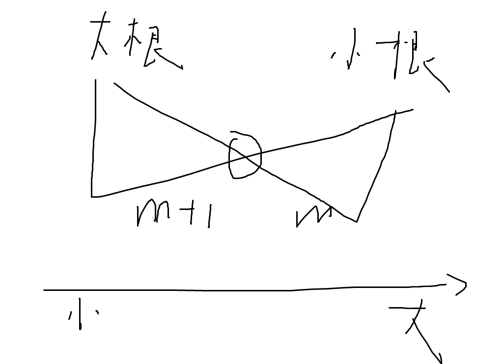

# ACM


## 基础算法


### 搜索

#### DFS
```python

```


#### BFS


### 二分查找
```python
def binary_search(arr, target):
    left, right = 0, len(arr) - 1
    while left <= right:
        mid = left + (right - left) // 2
        if arr[mid] == target:
            return mid
        elif arr[mid] < target:
            left = mid + 1
        else:
            right = mid - 1
    return -1  # 元素未找到
```

### 差分

#### 一维差分
```python
class Difference:
    def __init__(self, nums: list):
        self.n = len(nums)
        self.diff = [0] * (self.n + 1)  # 差分数组，长度比原数组多一个元素
        self.build(nums)

    def build(self, nums: list) -> None:
        """根据原始数组构建差分数组"""
        self.diff[0] = nums[0]
        for i in range(1, self.n):
            self.diff[i] = nums[i] - nums[i - 1]

    def update(self, left: int, right: int, val: int) -> None:
        """对区间 [left, right] 加上 val"""
        self.diff[left] += val
        if right + 1 < self.n:
            self.diff[right + 1] -= val

    def result(self) -> list:
        """恢复原数组"""
        res = [0] * self.n
        res[0] = self.diff[0]
        for i in range(1, self.n):
            res[i] = res[i - 1] + self.diff[i]
        return res
```


### 倍增


## 数据结构

### 堆


#### 对顶堆
```python
import heapq

class MedianFinder:
    def __init__(self):
        # 保证最小堆中所有元素都比
        # 最大堆（用负数来模拟最大堆，heapq默认小根堆)
        self.max_heap = []  
        # 最小堆
        self.min_heap = []  

    def add_num(self, num: int) -> None:
        # 首先将数添加到最大堆或者最小堆中
        if len(self.max_heap) == 0 or num <= -self.max_heap[0]:
            # 向最大堆插入
            heapq.heappush(self.max_heap, -num)
        else:
            # 向最小堆插入
            heapq.heappush(self.min_heap, num)
        
        # 保证两个堆的大小差不超过1
        if len(self.max_heap) > len(self.min_heap) + 1:
            # 如果最大堆多了，将最大堆的堆顶移动到最小堆
            heapq.heappush(self.min_heap, -heapq.heappop(self.max_heap))
        elif len(self.min_heap) > len(self.max_heap):
            # 如果最小堆多了，将最小堆的堆顶移动到最大堆
            heapq.heappush(self.max_heap, -heapq.heappop(self.min_heap))

    def find_median(self) -> float:
        # 如果两个堆的大小相同，返回堆顶元素的平均值
        if len(self.max_heap) == len(self.min_heap):
            return (-self.max_heap[0] + self.min_heap[0]) / 2.0
        # 如果最大堆多一个元素，返回最大堆堆顶元素
        return -self.max_heap[0]

```

对顶堆求中位数（大根堆m+1,小根堆m，中位数就是多出的那个1）





### 并查集
```python
class UnionFind:
    def __init__(self, n: int):
        # 初始化并查集，每个元素的父节点是它自己
        self.parent = list(range(n))
    
    def find(self, x: int) -> int:
        # 查找元素 x 的根节点，并进行路径压缩
        if self.parent[x] != x:
            self.parent[x] = self.find(self.parent[x])  # 递归查找并路径压缩
        return self.parent[x]
    
    def union(self, x: int, y: int) -> None:
        # 合并元素 x 和 y
        rootX = self.find(x)
        rootY = self.find(y)
        
        if rootX != rootY:
            self.parent[rootX] = rootY  # 将 x 的根节点指向 y 的根节点

    def connected(self, x: int, y: int) -> bool:
        # 判断 x 和 y 是否属于同一个集合
        return self.find(x) == self.find(y)
```

## 字符串

### KMP
```python
def KMP_search(text, pattern):
    # 计算部分匹配表
    def compute_pi(pattern):
        m = len(pattern)
        pi = [0] * m  # 部分匹配表
        k = 0  # 前缀后缀匹配的长度
        for i in range(1, m):
            while k > 0 and pattern[k] != pattern[i]:
                k = pi[k - 1]
            if pattern[k] == pattern[i]:
                k += 1
            pi[i] = k
        return pi

    # 主字符串和模式字符串的长度
    n = len(text)
    m = len(pattern)

    # 构造部分匹配表
    pi = compute_pi(pattern)

    # 匹配过程
    q = 0  # 模式串的匹配位置
    for i in range(n):
        while q > 0 and pattern[q] != text[i]:
            q = pi[q - 1]  # 通过部分匹配表跳跃

        if pattern[q] == text[i]:
            q += 1

        if q == m:  # 找到匹配
            print(f"Pattern found at index {i - m + 1}")
            q = pi[q - 1]  # 使用部分匹配表跳到下一位置

# 示例
text = "ababcababcababc"
pattern = "ababc"
KMP_search(text, pattern)
```

最长的前后缀匹配长度


pi[i]: 部分匹配表
- 表示子串 pattern[0...i] 的最长相同前后缀的长度
- 每个位置之前的子字符串的最长相同前后缀的长度
- 表示以 pattern[i] 结尾的子串中，最长的前后缀匹配长度


字符串匹配
KMP 算法的核心思想是：
- 预处理阶段：构建一个部分匹配表（pi 数组），该数组记录了每个位置之前的字符串的最长前缀和最长后缀的匹配长度。
- 匹配阶段：利用部分匹配表来决定匹配失败时应该跳到哪里，从而避免无谓的回退

KMP 算法步骤
- 部分匹配表：pi[i] 表示字符串 pattern[0...i] 的最大前后缀匹配长度。这个表可以帮助我们在出现不匹配时，不用回溯到 i-1，而是直接跳到 pi[i-1] 位置。
- 匹配过程：在匹配主字符串和模式字符串时，如果遇到不匹配的字符，利用 pi 表来跳过已知的匹配部分，减少不必要的比较


KMP实例：
模式串：pattern = "aabaa"
我们来一步步计算它的 pi 数组。

计算过程：
1. pi[0]：
    pattern[0] = 'a'，这是模式串的第一个字符。它没有前缀和后缀，所以 pi[0] = 0。
2. pi[1]：
    pattern[0...1] = "aa"。
    子串 "aa" 的前缀是 'a'，后缀也是 'a'，最长的相同前后缀长度为 1，所以 pi[1] = 1。
3. pi[2]：
    pattern[0...2] = "aab"。
    子串 "aab" 的前缀是 'a'，后缀是 'b'，没有相同的前后缀，因此 pi[2] = 0。
4. pi[3]：
    pattern[0...3] = "aaba"。
    子串 "aaba" 的前缀是 'a'，后缀也是 'a'，最长的相同前后缀长度是 1，所以 pi[3] = 1。
5. pi[4]：
    pattern[0...4] = "aabaa"。
    子串 "aabaa" 的前缀是 'aa'，后缀也是 'aa'，最长的相同前后缀长度是 2，所以 pi[4] = 2


## 动态规划


## 图论


### 图


#### 图的存储


##### 邻接表
```python
n = 5  # 点数
# 1~n
graph = [[] for _ in range(n + 1)]

# 添加边：u - v，权值 w
def add_edge(u, v, w):
    graph[u].append((v, w))
    graph[v].append((u, w))  # 如果是无向图

add_edge(1, 2, 3)
add_edge(1, 3, 4)
```


##### 邻接矩阵
```python
n = 5
INF = float('inf')
# 1~n
graph = [[INF] * (n + 1) for _ in range(n + 1)]

# 添加边 u -> v，权值 w
def add_edge(u, v, w):
    graph[u][v] = w
    graph[v][u] = w  # 若是无向图

add_edge(1, 2, 5)
```


#### 拓扑排序
```python
from collections import deque

N = 100010
graph = [[] for _ in range(N)]  # 邻接表
in_degree = [0] * N             # 入度表

def add_edge(u, v):
    graph[u].append(v)
    in_degree[v] += 1

def topological_sort(n):
    q = deque()
    res = []

    for i in range(1, n + 1):
        if in_degree[i] == 0:
            q.append(i)

    while q:
        u = q.popleft()
        res.append(u)
        for v in graph[u]:
            in_degree[v] -= 1
            if in_degree[v] == 0:
                q.append(v)

    if len(res) == n:
        return res      # 存在拓扑序
    else:
        return []       # 有环，拓扑排序失败
```


#### 二分图 （DFS 染色法）
```python
def is_bipartite(n, edges):
    graph = [[] for _ in range(n + 1)]
    for u, v in edges:
        graph[u].append(v)
        graph[v].append(u)

    color = [None] * (n + 1)

    def dfs(u, c):
        color[u] = c
        for v in graph[u]:
            if color[v] is None:
                if not dfs(v, c ^ 1):
                    return False
            elif color[v] == c:
                return False
        return True

    for i in range(1, n + 1):
        if color[i] is None:
            if not dfs(i, 0):
                return False
    return True
```

##### 二分图最大匹配 （匈牙利算法）
```python
def hungarian(n, m, edges):
    """
    n: 左侧点个数（编号 1 ~ n）
    m: 右侧点个数（编号 1 ~ m）
    edges: 二分图边列表 [(u, v), ...]，其中 u ∈ [1, n], v ∈ [1, m]
    """
    graph = [[] for _ in range(n + 1)]
    # 邻接表
    for u, v in edges:
        graph[u].append(v)

    match = [0] * (m + 1)  # 右侧点的匹配对象（左侧点编号）
    used = [False] * (m + 1)

    def dfs(u):
        for v in graph[u]:
            if not used[v]:
                used[v] = True
                if match[v] == 0 or dfs(match[v]):
                    match[v] = u
                    return True
        return False

    res = 0
    for u in range(1, n + 1):
        used = [False] * (m + 1)
        if dfs(u):
            res += 1
    return res
```

DFS增广路径


### 树


#### LCA (第k个祖先)
```python
import math

class BinaryLifting:
    def __init__(self, n, tree):
        self.n = n  # 节点数
        self.tree = tree  # 邻接表表示树
        self.LOG = math.ceil(math.log2(n))  # 计算最大深度
        self.dp = [[-1] * (self.LOG) for _ in range(n)]  # 初始化倍增表，-1 表示不存在
        self.depth = [-1] * n  # 存储每个节点的深度
        self.preprocess()

    def preprocess(self):
        """预处理倍增表，计算每个节点的 2^i 祖先"""
        self.dfs(0, -1, 0)  # 从根节点开始 DFS，初始化深度和 dp[x][0]

        # 计算倍增表
        for i in range(1, self.LOG):
            for node in range(self.n):
                if self.dp[node][i - 1] != -1:
                    self.dp[node][i] = self.dp[self.dp[node][i - 1]][i - 1]

    def dfs(self, node, parent, depth):
        """深度优先搜索，初始化深度和 dp[0][node]"""
        self.dp[node][0] = parent
        self.depth[node] = depth

        # 递归遍历子节点
        for child in self.tree[node]:
            # 防止向上遍历
            if child != parent:
                self.dfs(child, node, depth + 1)

    def get_kth_ancestor(self, node, k):
        """查询节点 node 的第 k 个祖先"""
        for i in range(self.LOG - 1, -1, -1):
            if k >= (1 << i):
                node = self.dp[node][i]
                if node == -1:  # 如果该祖先不存在
                    return -1
                k -= (1 << i)
        return node

    def lca(self, u, v):
        """查询节点 u 和 v 的最近公共祖先 (LCA)"""
        # 如果 u 的深度小于 v，则交换 u 和 v
        if self.depth[u] < self.depth[v]:
            u, v = v, u

        # 先让 u 和 v 在相同深度
        u = self.get_kth_ancestor(u, self.depth[u] - self.depth[v])

        if u == v:
            return u

        # 同时上跳，直到找到 LCA
        for i in range(self.LOG - 1, -1, -1):
            # 不相等才上跳，最后0的时候是没跳的
            if self.dp[u][i] != self.dp[v][i]:
                u = self.dp[u][i]
                v = self.dp[v][i]

        return self.dp[u][0]  # 返回它们的父节点，就是 LCA

# 树的邻接表表示（例子：有 7 个节点的树）
# 示例树： 0 - 1, 0 - 2, 1 - 3, 1 - 4, 2 - 5, 2 - 6
tree = {
    0: [1, 2],
    1: [0, 3, 4],
    2: [0, 5, 6],
    3: [1],
    4: [1],
    5: [2],
    6: [2]
}

# 创建 BinaryLifting 实例
n = 7
bl = BinaryLifting(n, tree)

# 查询节点 5 的第 2 个祖先
print(bl.get_kth_ancestor(5, 2))  # 输出: 0 (5 的第 2 个祖先是节点 0)

# 查询节点 3 和 5 的最近公共祖先
print(bl.lca(3, 5))  # 输出: 0 (3 和 5 的 LCA 是节点 0)
```


## 数论