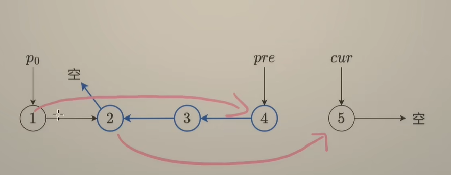
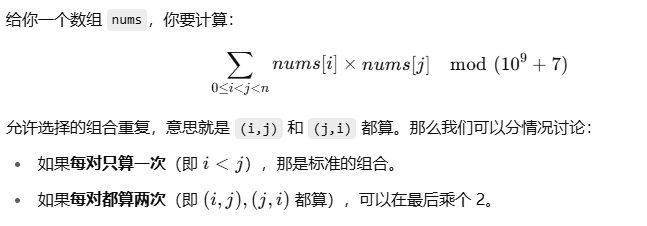

# ACM

``


## 基础算法


### 大数运算
```python
class BigInt:
    def __init__(self, number: str):
        if not number.isdigit():
            raise ValueError("Only non-negative integers are supported.")
        # 倒序存储，每个元素是一位
        self.digits = list(map(int, reversed(number)))

    def __str__(self):
        return ''.join(map(str, reversed(self.digits)))

    def __add__(self, other: 'BigInt') -> 'BigInt':
        max_len = max(len(self.digits), len(other.digits))
        result = []
        carry = 0
        for i in range(max_len):
            a = self.digits[i] if i < len(self.digits) else 0
            b = other.digits[i] if i < len(other.digits) else 0
            total = a + b + carry
            result.append(total % 10)
            carry = total // 10
        if carry:
            result.append(carry)
        return BigInt(''.join(map(str, reversed(result))))

    def __sub__(self, other: 'BigInt') -> 'BigInt':
        """只支持大的减小的"""
        if self < other:
            raise ValueError("Negative result not supported.")
        result = []
        borrow = 0
        for i in range(len(self.digits)):
            a = self.digits[i]
            b = other.digits[i] if i < len(other.digits) else 0
            sub = a - b - borrow
            if sub < 0:
                sub += 10
                borrow = 1
            else:
                borrow = 0
            result.append(sub)
        # 去除前导 0
        while len(result) > 1 and result[-1] == 0:
            result.pop()
        return BigInt(''.join(map(str, reversed(result))))

    def __mul__(self, other: 'BigInt') -> 'BigInt':
        result = [0] * (len(self.digits) + len(other.digits))
        for i in range(len(self.digits)):
            for j in range(len(other.digits)):
                result[i + j] += self.digits[i] * other.digits[j]
        # 处理进位
        for i in range(len(result)):
            if result[i] >= 10:
                if i + 1 == len(result):
                    result.append(0)
                result[i + 1] += result[i] // 10
                result[i] %= 10
        # 去除前导 0
        while len(result) > 1 and result[-1] == 0:
            result.pop()
        return BigInt(''.join(map(str, reversed(result))))

    def __lt__(self, other: 'BigInt') -> bool:
        if len(self.digits) != len(other.digits):
            return len(self.digits) < len(other.digits)
        # 从高位比
        for a, b in zip(reversed(self.digits), reversed(other.digits)):
            if a != b:
                return a < b
        return False

    def __eq__(self, other: 'BigInt') -> bool:
        return self.digits == other.digits

    def divmod_small(self, divisor: int) -> Tuple['BigInt', int]:
        """除以小整数 divisor，返回 (商 BigInt, 余数 int)"""
        if divisor <= 0:
            raise ValueError("Divisor must be positive.")

        result = []
        remainder = 0
        # 从高位开始处理
        for digit in reversed(self.digits):
            remainder = remainder * 10 + digit
            result_digit = remainder // divisor
            result.append(result_digit)
            remainder %= divisor

        # 去除前导 0
        while len(result) > 1 and result[0] == 0:
            result.pop(0)

        return BigInt(''.join(map(str, result))), remainder
```

python自带大数运算


### 排序

#### 选择排序 
```python
def selection_sort(arr):
    n = len(arr)
    for i in range(n - 1):
        min_idx = i
        for j in range(i + 1, n):
            if arr[j] < arr[min_idx]:
                min_idx = j
        arr[i], arr[min_idx] = arr[min_idx], arr[i]
    return arr
```

每次向后寻找最小的，然后和当前交换


#### 冒泡排序
```python
def bubble_sort(arr):
    n = len(arr)
    for i in range(n):
        swapped = False
        for j in range(n - 1 - i):
            if arr[j] > arr[j + 1]:
                arr[j], arr[j + 1] = arr[j + 1], arr[j]
                swapped = True
        if not swapped:  # 提前结束优化
            break
    return arr
```


#### 快速排序
```python
def quick_sort(arr: List[int]):
    if len(arr) <= 1:
        return arr
    pivot = arr[0]

    # 小于中间点的
    left = quick_sort([x for x in arr[1:] if x < pivot])
    
    # 大于中间点的
    right = quick_sort([x for x in arr[1:] if x >= pivot])
    return left + [pivot] + right
```

基于中间点分治


#### 归并排序
```python
def merge_sort(arr):
    if len(arr) <= 1:
        return arr
    
    # 直接分治
    mid = len(arr) // 2
    left = merge_sort(arr[:mid])
    right = merge_sort(arr[mid:])
    
    res = []
    i = j = 0
    # 合并
    while i < len(left) and j < len(right):
        if left[i] <= right[j]:
            res.append(left[i])
            i += 1
        else:
            res.append(right[j])
            j += 1
    res += left[i:] + right[j:]
    return res
```

直接分治然后合并


#### 堆排序
```python
import heapq

def heap_sort(arr):
    heapq.heapify(arr)
    return [heapq.heappop(arr) for _ in range(len(arr))]
```


#### 桶排序
```python
def bucket_sort(arr, bucket_size=5):
    if len(arr) == 0:
        return []
    
    # 获取最小值、最大值
    min_val, max_val = min(arr), max(arr)
    bucket_count = (max_val - min_val) // bucket_size + 1
    buckets = [[] for _ in range(bucket_count)]
    
    # 基于数值大小分桶，bucket_size分桶数值
    for num in arr:
        index = (num - min_val) // bucket_size
        buckets[index].append(num)
    
    # 分桶排序
    res = []
    for b in buckets:
        res.extend(sorted(b))  # 可以替换为 quick_sort(b)
    return res
```

分块排序


### 搜索

#### DFS
```python
# 图的 DFS：邻接表表示，visited 记录访问过的节点
def dfs_graph(u, graph, visited):
    visited.add(u)
    # 访问或处理 u
    for v in graph[u]:
        if v not in visited:
            dfs_graph(v, graph, visited)

# 示例用法（调用时初始化 visited 为空集合）：
graph = {0: [1,2], 1: [0,2], 2: [0,1]}  # 无向图邻接表
visited = set()
dfs_graph(0, graph, visited)
```

DFS（深度优先搜索）


#### BFS
```python
from collections import deque
# 图的 BFS：邻接表表示
def bfs_graph(start, graph):
    visited = set([start])
    q = deque([start])
    while q:
        u = q.popleft()
        # 访问或处理 u
        for v in graph[u]:
            if v not in visited:
                visited.add(v)
                q.append(v)
    # 返回 visited 或其它结果

# 示例用法：
graph = {0: [1,2], 1: [0,3], 2: [0], 3: [1]}
bfs_graph(0, graph)
```

BFS（广度优先搜索）


#### 双向BFS
```python
from collections import deque
def bidirectional_bfs(adj, start, goal):
    if start == goal: return 0
    visited_s = {start:0}
    visited_g = {goal:0}
    q_s = deque([start]); q_g = deque([goal])
    while q_s and q_g:
        # 向前扩展一层
        for _ in range(len(q_s)):
            u = q_s.popleft()
            for v in adj[u]:
                if v not in visited_s:
                    visited_s[v] = visited_s[u] + 1
                    if v in visited_g:
                        return visited_s[v] + visited_g[v]
                    q_s.append(v)
        # 向后扩展一层
        for _ in range(len(q_g)):
            u = q_g.popleft()
            for v in adj[u]:
                if v not in visited_g:
                    visited_g[v] = visited_g[u] + 1
                    if v in visited_s:
                        return visited_s[v] + visited_g[v]
                    q_g.append(v)
    return -1  # 不可达时返回 -1
```

双向 BFS：同时从起点和终点向中间搜索，适用于无权图最短路径查找，可大幅降低搜索空间


#### 记忆化搜索


### 贪心


#### 木桶盛水
```python
def maxArea(height: List[int]) -> int:
    left = 0
    right = len(height) - 1
    res = 0
    while left < right:
        res = max(res, (right - left) * min(height[left], height[right]))
        # 每次移动较小的那块
        if height[left] <= height[right]:
            left += 1
        else:
            right -= 1
    return res
```

局部最优能保证全局最优的情况


### 双指针


#### 双数之和
```python
def twoSum(numbers: List[int], target: int) -> List[int]:
    numbers.sort()
    left = 0
    right = len(numbers) - 1
    while left < right:
        num_sum = numbers[left] + numbers[right]
        if num_sum == target:
            break
        elif num_sum > target:
            right -= 1
        else:
            left += 1
    return [left, right]
```

由外向内缩小双指针
- 数组必须有序


#### 长度最小的子数组
```python
def minSubArrayLen(target: int, nums: List[int]) -> int:
    n = len(nums)
    left = 0
    res = n + 1
    s = 0
    # 枚举右指针
    for i, x in enumerate(nums):
        s += x
        # 符合条件，缩小左指针
        while s >= target:
            res = min(res, i - left + 1)
            s -= nums[left]
            left += 1
    return res if res <= n else 0
```

枚举右指针，移动左指针


### 二分查找
```python
def binary_search(arr, target):
    left, right = 0, len(arr) - 1
    while left <= right:
        mid = left + (right - left) // 2
        if arr[mid] == target:
            return mid
        elif arr[mid] < target:
            left = mid + 1
        else:
            right = mid - 1
    return -1  # 元素未找到

```

- 二分查找注意区分移动右边界还是左边界（小于最大值，大于最小值）


#### 大于等于最小索引（Lower_Bound）
```python
def lower_bound(nums: List[int], target: int) -> int:
    left = 0
    right = len(nums) - 1
    while left <= right:
        mid = (left + right) // 2
        if nums[mid] < target:
            left = mid + 1
        else:
            right = mid - 1
    return left
```


#### 大于最小索引（Upper_Bound）
```python
def upper_bound(nums: List[int], target: int) -> int:
    left = 0
    right = len(nums) - 1
    while left <= right:
        mid = (left + right) // 2
        if nums[mid] <= target:
            left = mid + 1
        else:
            right = mid - 1
    return left
```


#### 符合条件的最小元素
```python
# 索引 0 ~ n-1
ans = 0
left, right = 0, len(arr) - 1
while left <= right:
    mid = (left + right) // 2
    if check(arr[i]):
        ans = times[mid]
        right = mid - 1  # 继续向左找更小的
    else:
        left = mid + 1
```


#### 范围查询出现频次
```python
from collections import defaultdict
from bisect import bisect_left, bisect_right

pos = defaultdict(list)  # pos[x] 存储 x 的所有位置（有序）

# 初始化
for idx, val in enumerate(a):
    pos[val].append(idx)

# 查询 x 在 [l, r] 中出现次数
def query(x, l, r):
    arr = pos[x]
    return bisect_right(arr, r) - bisect_left(arr, l)
```

- 每个值维护一个下标数组
- 二分查找下标范围


#### 三分查找
```python
def ternary_search(f, L, R, eps=1e-6):
    """
    f: 单峰函数
    [L, R]: 搜索区间
    eps: 精度，当区间长度 < eps 时停止
    """
    lo, hi = L, R
    while hi - lo > eps:
        m1 = lo + (hi - lo) / 3
        m2 = hi - (hi - lo) / 3
        if f(m1) < f(m2):
            lo = m1
        else:
            hi = m2
    # 返回区间中点或 lo/hi
    return (lo + hi) / 2
```

常用于求极值点


### 前缀和

- 预先构造
- 常用于静态区间查询（求和、异或）


### 差分


#### 一维差分
```python
# 区间更新
class Difference:
    def __init__(self, nums: list):
        self.n = len(nums)
        self.diff = [0] * (self.n + 1)  # 差分数组，长度比原数组多一个元素
        self.build(nums)

    def build(self, nums: list) -> None:
        """根据原始数组构建差分数组"""
        self.diff[0] = nums[0]
        for i in range(1, self.n):
            self.diff[i] = nums[i] - nums[i - 1]

    def update(self, left: int, right: int, val: int) -> None:
        """对区间 [left, right] 加上 val"""
        self.diff[left] += val
        if right + 1 < self.n:
            self.diff[right + 1] -= val

    def result(self) -> list:
        """恢复原数组"""
        res = [0] * self.n
        res[0] = self.diff[0]
        for i in range(1, self.n):
            res[i] = res[i - 1] + self.diff[i]
        return res
```


### 分块


#### 单点修改 & 区间求和
```python
import math

class SqrtDecomposition:
    def __init__(self, data):
        self.n = len(data)
        # 块大小
        self.block_size = int(math.sqrt(self.n)) + 1
        self.data = list(data)
        self.blocks = [0] * self.block_size

        # 初始化分块
        for i in range(self.n):
            self.blocks[i // self.block_size] += self.data[i]

    def update(self, idx, val):
        """将位置 idx 的值改为 val"""
        block_idx = idx // self.block_size
        self.blocks[block_idx] += val - self.data[idx]
        self.data[idx] = val

    def query(self, l, r):
        """查询区间 [l, r] 的和"""
        res = 0
        while l <= r:
            # 整块移动，如果 l 在块起点，且整个块都在 [l, r] 内
            if l % self.block_size == 0 and l + self.block_size - 1 <= r:
                res += self.blocks[l // self.block_size]
                l += self.block_size
            # 逐步移动
            else:
                res += self.data[l]
                l += 1
        return res
```


### 倍增


#### 倍增跳跃
```python
def jump_by_power(arr, start, steps):
    """
    arr[i]: 表示从 i 跳一步能跳到哪
    steps: 要跳几步
    jump[i][k]: 从i跳 2^k 步能跳到哪
    """
    n = len(arr)
    LOGN = steps.bit_length()
    jump = [[-1] * LOGN for _ in range(n)]
    for i in range(n):
        jump[i][0] = arr[i]
    for k in range(1, LOGN):
        for i in range(n):
            if jump[i][k-1] != -1:
                jump[i][k] = jump[jump[i][k-1]][k-1]
    
    # 使用时对数值进行二进制拆分
    pos = start
    for k in range(LOGN):
        if steps & (1 << k):
            pos = jump[pos][k]
            if pos == -1:
                break
    return pos
```


### 离散化
```python
coords = sorted(set(original_values))
comp = {v:i for i,v in enumerate(coords)}
# 现在 comp[x] 即为 x 的离散化下标  
```


### 离线处理

#### 莫队


#### CDQ


### 逆波兰表达式
```python
# 计算符号优先级
def precedence(op):
    if op in ('+', '-'):
        return 1
    if op in ('*', '/'):
        return 2
    return 0

# 计算表达式
def apply_op(a, b, op):
    if op == '+': return a + b
    if op == '-': return a - b
    if op == '*': return a * b
    if op == '/': return a / b

# 中缀转后缀
def to_rpn(expression):
    output = []
    ops = []
    i = 0
    while i < len(expression):
        ch = expression[i]
        if ch == ' ':
            i += 1
            continue
        # 获取
        if ch.isdigit() or ch == '.':
            num = []
            while i < len(expression) and (expression[i].isdigit() or expression[i] == '.'):
                num.append(expression[i])
                i += 1
            output.append(''.join(num))
            continue
        elif ch == '(':
            ops.append(ch)
        elif ch == ')':
            while ops and ops[-1] != '(':
                output.append(ops.pop())
            ops.pop()  # 弹出 '('
        else:
            # 遇到运算符时，先把优先级（>=）的弹出
            while ops and precedence(ops[-1]) >= precedence(ch):
                output.append(ops.pop())
            ops.append(ch)
        i += 1
    while ops:
        output.append(ops.pop())
    return output

# 利用栈计算后缀表达式
def eval_rpn(rpn):
    stack = []
    for token in rpn:
        if token not in '+-*/':
            stack.append(float(token))
        else:
            b = stack.pop()
            a = stack.pop()
            stack.append(apply_op(a, b, token))
    return stack[0]


def evaluate(expression):
    rpn = to_rpn(expression)
    return eval_rpn(rpn)

# 示例
# 后缀表达式 3 2 1 - 5 * 2 3 + / +
expr = "3 + (2 - 1) * 5 / (2 + 3)"
print(evaluate(expr))  # 输出 4.0
```

中缀转后缀 + 逆波兰表达式（RPN）求值实现完整括号四则运算


## 数据结构


### 链表
```python
class ListNode:
    def __init__(self, val=0, next=None):
        self.val = val
        self.next = next

class ListNodeOperator:
    # 指定个数反转
    def reverseBetween(self, head: Optional[ListNode], left: int, right: int) -> Optional[ListNode]:
        if left > right: return head
        dummy = ListNode(next=head)
        p0 = myhead
        for _ in range(left - 1):
            p0 = p0.next
        pre = None
        cur = p0.next
        for _ in range(right - left + 1):
            nxt = cur.next
            cur.next = pre
            pre = cur
            cur = nxt
        p0.next.next = cur
        p0.next = pre
        return myhead.next

    # 获取链表长度
    def get_count(self, head: Optional[ListNode]) -> int:
        res = 0
        while head:
            res += 1
            head = head.next
        return res

    # 链表全部反转
    def reverseList(self, head: Optional[ListNode]) -> Optional[ListNode]:
        cnt = self.get_count(head)
        return self.reverseBetween(head, 1, cnt)
    
    # 插入头节点
    def insert_head(self, head: Optional[ListNode], val: int) -> ListNode:
        return ListNode(val, head)

    # 插入尾节点
    def insert_tail(self, head: Optional[ListNode], val: int) -> ListNode:
        dummy = ListNode(0, head)
        cur = dummy
        while cur.next:
            cur = cur.next
        cur.next = ListNode(val)
        return dummy.next
    
    # 指定位置前面插入
    def insert_at(self, head: Optional[ListNode], pos: int, val: int) -> ListNode:
        dummy = ListNode(0, head)
        cur = dummy
        for _ in range(pos):
            if not cur:
                raise IndexError("Position out of range")
            cur = cur.next
        new_node = ListNode(val, cur.next)
        cur.next = new_node
        return dummy.next

    # 删除指定元素
    def delete_value(self, head: Optional[ListNode], val: int) -> ListNode:
        dummy = ListNode(0, head)
        cur = dummy
        while cur.next:
            if cur.next.val == val:
                cur.next = cur.next.next
                break
            cur = cur.next
        return dummy.next

    # 删除指定位置的元素
    def delete_at(self, head: Optional[ListNode], pos: int) -> ListNode:
        dummy = ListNode(0, head)
        cur = dummy
        for _ in range(pos):
            if not cur.next:
                raise IndexError("Position out of range")
            cur = cur.next
        cur.next = cur.next.next if cur.next else None
        return dummy.next

    # 查找匹配的匹配的第一个元素
    def find_by_value(self, head: Optional[ListNode], val: int) -> Optional[ListNode]:
        while head:
            if head.val == val:
                return head
            head = head.next
        return None

    # 打印链表
    def print_list(self, head: Optional[ListNode]) -> None:
        res = []
        while head:
            res.append(str(head.val))
            head = head.next
        print(" -> ".join(res))
```


#### 链表反转
```python
class ListNode:
    def __init__(self, val=0, next=None):
        self.val = val
        self.next = next

def reverseBetween(self, head: Optional[ListNode], left: int, right: int) -> Optional[ListNode]:
    """
    反转第left个到第right个节点
    left、right：1~n
    """
    # 哨兵前置节点
    myhead = ListNode(next=head)
    # 反转前置节点
    p0 = myhead
    for _ in range(left - 1):
        p0 = p0.next
    
    # 反转 right - left _ 1次
    pre = None
    cur = p0.next
    for _ in range(right - left + 1):
        # 反转next
        nxt = cur.next
        cur.next = pre
        # 指针后移
        pre = cur
        cur = nxt
    
    # 连接反转链表
    p0.next.next = cur
    p0.next = pre
    return myhead.next
```




### 堆


#### 对顶堆


##### 中位数
```python
import heapq

class MedianFinder:
    def __init__(self):
        # 保证最小堆中所有元素都比
        # 最大堆（用负数来模拟最大堆，heapq默认小根堆)
        self.max_heap = []  
        # 最小堆
        self.min_heap = []  

    def add_num(self, num: int) -> None:
        # 首先将数添加到最大堆或者最小堆中
        if len(self.max_heap) == 0 or num <= -self.max_heap[0]:
            # 向最大堆插入
            heapq.heappush(self.max_heap, -num)
        else:
            # 向最小堆插入
            heapq.heappush(self.min_heap, num)
        
        # 保证两个堆的大小差不超过1
        if len(self.max_heap) > len(self.min_heap) + 1:
            # 如果最大堆多了，将最大堆的堆顶移动到最小堆
            heapq.heappush(self.min_heap, -heapq.heappop(self.max_heap))
        elif len(self.min_heap) > len(self.max_heap):
            # 如果最小堆多了，将最小堆的堆顶移动到最大堆
            heapq.heappush(self.max_heap, -heapq.heappop(self.min_heap))

    def find_median(self) -> float:
        # 如果两个堆的大小相同，返回堆顶元素的平均值
        if len(self.max_heap) == len(self.min_heap):
            return (-self.max_heap[0] + self.min_heap[0]) / 2.0
        # 如果最大堆多一个元素，返回最大堆堆顶元素
        return -self.max_heap[0]

```

对顶堆求中位数（大根堆m+1,小根堆m，中位数就是多出的那个1）


### 栈

#### 单调栈

找每个数第一个比它小的数
- 维护一个递增的单调栈
- 栈中维护数组索引
- 栈中元素被弹出时即找到了第一个比它小的数
```python
def next_smaller_elements(nums):
    n = len(nums)
    res = [-1] * n
    stack = []

    for i in range(n):
        while stack and nums[stack[-1]] > nums[i]:
            idx = stack.pop()
            # 区分这里用 idx 还是 i
            res[idx] = nums[i]
        stack.append(i)

    return res
```


##### 柱形图最大面积
```python
def largestRectangleArea(heights: List[int]) -> int:
    """维护单调递增栈，记录最远到达地方"""
    n = len(heights)
    stack = []
    res_left = [i for i in range(n)]
    for i, x in enumerate(heights):
        while stack and heights[stack[-1]] >= x:
            idx = stack.pop()
            res_left[i] = res_left[idx]
        stack.append(i)
    
    # 清空单调栈
    stack.clear()

    res_right = [i for i in range(n)]
    for i, x in enumerate(heights[::-1]):
        while stack and heights[stack[-1]] >= x:
            idx = stack.pop()
            res_right[n - 1 - i] = res_right[idx]
        stack.append(n - 1 - i) 
    # print(res_left)
    # print(res_right)
    return max([(res_right[i] - res_left[i] + 1) * heights[i] for i in range(n)])


print(largestRectangleArea(
    [2,1,5,6,2,3]
))
```


### 队列


#### 单调队列


##### 滑动窗口最值
```python
def maxSlidingWindow(nums: List[int], k: int) -> List[int]:
    from collections import deque
    # 单调队列，存放索引
    q = deque()
    res = []

    for i, x in enumerate(nums):
        # 维护一个单调递减队列
        while q and nums[q[-1]] <= x:
            q.pop() 
        q.append(i)
        if i >= k - 1:
            while q and q[0] < i - k + 1:
                q.popleft()
            res.append(nums[q[0]])
    return res
```


### 二叉树
```python

class TreeNode:
    def __init__(self, val: int = 0, left: Optional[TreeNode] = None, right: Optional[TreeNode] = None):
        self.val = val
        self.left = left
        self.right = right
from typing import Optional, List, Union
from collections import deque

class TreeNodeOperator:
    def preorder(self, root: Optional[TreeNode]) -> List[int]:
        """前序遍历（递归）"""
        if not root:
            return []
        return [root.val] + self.preorder(root.left) + self.preorder(root.right)

    def inorder(self, root: Optional[TreeNode]) -> List[int]:
        """中序遍历（递归）"""
        if not root:
            return []
        return self.inorder(root.left) + [root.val] + self.inorder(root.right)

    def postorder(self, root: Optional[TreeNode]) -> List[int]:
        """后序遍历（递归）"""
        if not root:
            return []
        return self.postorder(root.left) + self.postorder(root.right) + [root.val]

    def levelorder(self, root: Optional[TreeNode]) -> List[List[int]]:
        """层序遍历"""
        if not root:
            return []
        # result记录所有层的节点值，二维list
        result = []
        queue = deque([root])
        while queue:
            # level记录每一层的节点值
            level = []
            for _ in range(len(queue)):
                node = queue.popleft()
                level.append(node.val)
                if node.left:
                    queue.append(node.left)
                if node.right:
                    queue.append(node.right)
            result.append(level)
        return result

    def maxDepth(self, root: Optional[TreeNode]) -> int:
        """树的最大深度"""
        if not root:
            return 0
        return 1 + max(self.maxDepth(root.left), self.maxDepth(root.right))

    def invertTree(self, root: Optional[TreeNode]) -> Optional[TreeNode]:
        """反转二叉树"""
        if not root:
            return None
        root.left, root.right = self.invertTree(root.right), self.invertTree(root.left)
        return root

    def buildTreeFromList(self, data: List[Union[int, None]]) -> Optional[TreeNode]:
        """
        从层序列表构建二叉树，空用 None 表示
        例如：[1, 2, 3, None, 4] 表示：
              1
             / \
            2   3
             \
              4
        """
        if not data or data[0] is None:
            return None
        root = TreeNode(data[0])
        queue = deque([root])
        i = 1
        while queue and i < len(data):
            node = queue.popleft()
            # 构建左节点
            if i < len(data) and data[i] is not None:
                node.left = TreeNode(data[i])
                queue.append(node.left)
            i += 1
            # 构建右节点
            if i < len(data) and data[i] is not None:
                node.right = TreeNode(data[i])
                queue.append(node.right)
            i += 1
        return root

    def getNodeCount(self, root: Optional[TreeNode]) -> int:
        """返回节点总数"""
        if not root:
            return 0
        return 1 + self.getNodeCount(root.left) + self.getNodeCount(root.right)
```

#### 二叉树深度
#### 二叉树反转


### 并查集
```python
class UnionFind:
    def __init__(self, n: int):
        # 初始化并查集，每个元素的父节点是它自己
        self.parent = list(range(n))
    
    def find(self, x: int) -> int:
        # 查找元素 x 的根节点，并进行路径压缩
        if self.parent[x] != x:
            self.parent[x] = self.find(self.parent[x])  # 递归查找并路径压缩
        return self.parent[x]
    
    def union(self, x: int, y: int) -> None:
        # 合并元素 x 和 y
        rootX = self.find(x)
        rootY = self.find(y)
        
        if rootX != rootY:
            self.parent[rootX] = rootY  # 将 x 的根节点指向 y 的根节点

    def connected(self, x: int, y: int) -> bool:
        # 判断 x 和 y 是否属于同一个集合
        return self.find(x) == self.find(y)

    def count_components(self):
        return len(set(self.find(i) for i in range(len(self.parent))))
```


### ST表
```python
class SparseTable:
    def __init__(self, nums):
        self.n = len(nums)
        self.k = int(math.log2(self.n)) + 1
        self.nums = nums
        self.st_max = [[0] * self.k for _ in range(self.n)]
        self.st_min = [[0] * self.k for _ in range(self.n)]

        # 初始化
        for i in range(self.n):
            self.st_max[i][0] = nums[i]
            self.st_min[i][0] = nums[i]

        # 构建 ST 表
        for j in range(1, self.k):
            for i in range(self.n - (1 << j) + 1):
                self.st_max[i][j] = max(self.st_max[i][j - 1], self.st_max[i + (1 << (j - 1))][j - 1])
                self.st_min[i][j] = min(self.st_min[i][j - 1], self.st_min[i + (1 << (j - 1))][j - 1])

    def query_max(self, l, r):
        """查询区间 [l, r] 内最大值"""
        j = int(math.log2(r - l + 1))
        return max(self.st_max[l][j], self.st_max[r - (1 << j) + 1][j])

    def query_min(self, l, r):
        """查询区间 [l, r] 内最小值"""
        j = int(math.log2(r - l + 1))
        return min(self.st_min[l][j], self.st_min[r - (1 << j) + 1][j])

# 基础使用
arr = [2, 1, 3, 4, 5]
st = SegmentTree(arr)

print(st.query_sum(1, 3))  # 1+3+4 = 8
print(st.query_max(1, 3))  # max(1,3,4) = 4
print(st.query_min(1, 3))  # min(1,3,4) = 1

st.update_range(1, 3, 2)  # 区间 [1,3] 加上 2

print(st.query_sum(1, 3))  # 3+5+6 = 14
print(st.query_max(1, 3))  # max(3,5,6) = 6
print(st.query_min(1, 3))  # min(3,5,6) = 3
```

### 树状数组（BIT）

- 前缀和算法
- 下标进行二进制拆分


#### 单点修改 & 区间求和
```python
class BIT:
    # 下标范围（1~n）
    def __init__(self, n):
        self.n = n
        self.tree = [0] * (n + 1)  # 1-based index

    def _lowbit(self, x):
        return x & -x

    def add(self, i, delta):
        """将位置 i 加上 delta"""
        while i <= self.n:
            self.tree[i] += delta
            i += self._lowbit(i)

    def query(self, i):
        """查询前缀和 [1, i]"""
        res = 0
        while i > 0:
            res += self.tree[i]
            i -= self._lowbit(i)
        return res

    def range_query(self, l, r):
        """查询区间 [l, r] 的和"""
        return self.query(r) - self.query(l - 1)
```

#### 二维树状数组


维护多个树状数组（BIT），每个 BIT 维护一个值 x 在数组中出现的频率，支持：
- 单点修改：将某个位置的值由旧值变成新值
- 区间查询：快速查询某个值 x 在区间 [l, r] 中出现次数
```python
class MultiValueBIT:
    def __init__(self, data, max_val):
        """
        data: 初始数组，长度 n
        max_val: 值域最大值，假设值是 1..max_val
        """
        self.n = len(data)
        self.max_val = max_val
        # 为每个值建一个 BIT，BIT 下标从 1 开始
        # BITs[0~max_val][1~n]
        # data[1~n]
        self.BITs = [[0] * (self.n + 1) for _ in range(max_val + 1)]
        self.data = [0] + data  # 1-based 索引方便处理
        
        # 初始化 BIT
        for i in range(1, self.n + 1):
            val = self.data[i]
            self._update_BIT(val, i, 1)

    def _lowbit(self, x):
        return x & (-x)
    
    def _update_BIT(self, val, idx, delta):
        """
        单棵 BIT 更新 val 对应的树状数组：位置 idx 增加 delta
        """
        while idx <= self.n:
            self.BITs[val][idx] += delta
            idx += self._lowbit(idx)
    
    def _query_BIT(self, val, idx):
        """
        查询 val 对应的树状数组前缀和：[1..idx]
        """
        res = 0
        while idx > 0:
            res += self.BITs[val][idx]
            idx -= self._lowbit(idx)
        return res
    
    def update(self, pos, new_val):
        """
        更新位置 pos 的值为 new_val
        """
        old_val = self.data[pos]
        if old_val == new_val:
            return
        # 先在 old_val 的 BIT 中减去 1
        self._update_BIT(old_val, pos, -1)
        # 在 new_val 的 BIT 中加上 1
        self._update_BIT(new_val, pos, 1)
        # 更新数组记录
        self.data[pos] = new_val
    
    def query(self, val, left, right):
        """
        查询值为 val 的元素在区间 [left, right] 出现次数
        """
        return self._query_BIT(val, right) - self._query_BIT(val, left - 1)
```


### 线段树
```python
class SegmentTree:
    # 下标范围（0~n-1）
    def __init__(self, data):
        self.n = len(data)
        self.sum = [0] * (4 * self.n)
        self.max = [0] * (4 * self.n)
        self.min = [0] * (4 * self.n)
        self.lazy = [0] * (4 * self.n)
        self._build(data, 0, 0, self.n - 1)

    def _build(self, data, node, l, r):
        if l == r:
            self.sum[node] = self.max[node] = self.min[node] = data[l]
        else:
            mid = (l + r) // 2
            self._build(data, node * 2 + 1, l, mid)
            self._build(data, node * 2 + 2, mid + 1, r)
            self._push_up(node)

    def _push_up(self, node):
        self.sum[node] = self.sum[node * 2 + 1] + self.sum[node * 2 + 2]
        self.max[node] = max(self.max[node * 2 + 1], self.max[node * 2 + 2])
        self.min[node] = min(self.min[node * 2 + 1], self.min[node * 2 + 2])

    def _push_down(self, node, l, r):
        if self.lazy[node] != 0:
            mid = (l + r) // 2
            left = node * 2 + 1
            right = node * 2 + 2
            # 左孩子
            self.sum[left] += self.lazy[node] * (mid - l + 1)
            self.max[left] += self.lazy[node]
            self.min[left] += self.lazy[node]
            self.lazy[left] += self.lazy[node]
            # 右孩子
            self.sum[right] += self.lazy[node] * (r - mid)
            self.max[right] += self.lazy[node]
            self.min[right] += self.lazy[node]
            self.lazy[right] += self.lazy[node]
            # 清除当前标记
            self.lazy[node] = 0

    def update_range(self, ul, ur, val):
        """将区间 [ul, ur] 所有元素加上 val"""
        self._update_range(0, 0, self.n - 1, ul, ur, val)

    def _update_range(self, node, l, r, ul, ur, val):
        if ul <= l and r <= ur:
            self.sum[node] += val * (r - l + 1)
            self.max[node] += val
            self.min[node] += val
            self.lazy[node] += val
            return
        self._push_down(node, l, r)
        mid = (l + r) // 2
        if ul <= mid:
            self._update_range(node * 2 + 1, l, mid, ul, ur, val)
        if ur > mid:
            self._update_range(node * 2 + 2, mid + 1, r, ul, ur, val)
        self._push_up(node)

    def query_sum(self, ql, qr):
        return self._query(0, 0, self.n - 1, ql, qr, 'sum')

    def query_max(self, ql, qr):
        return self._query(0, 0, self.n - 1, ql, qr, 'max')

    def query_min(self, ql, qr):
        return self._query(0, 0, self.n - 1, ql, qr, 'min')

    def _query(self, node, l, r, ql, qr, typ):
        if ql > r or qr < l:
            if typ == 'sum':
                return 0
            elif typ == 'max':
                return float('-inf')
            else:  # min
                return float('inf')
        if ql <= l and r <= qr:
            if typ == 'sum':
                return self.sum[node]
            elif typ == 'max':
                return self.max[node]
            else:
                return self.min[node]
        self._push_down(node, l, r)
        mid = (l + r) // 2
        left = self._query(node * 2 + 1, l, mid, ql, qr, typ)
        right = self._query(node * 2 + 2, mid + 1, r, ql, qr, typ)
        if typ == 'sum':
            return left + right
        elif typ == 'max':
            return max(left, right)
        else:
            return min(left, right)
```


## 字符串

### 哈希（Hash）


字符串哈希


#### 滚动哈希


#### 二维哈希


### 字典树


### KMP
```python
def KMP_search(text, pattern):
    """
        text: 主字符串
        pattern: 要查询的匹配字符串
    """


    # 计算部分匹配表
    def compute_pi(pattern):
        m = len(pattern)
        pi = [0] * m  # 部分匹配表
        k = 0  # 前缀后缀匹配的长度
        for i in range(1, m):
            while k > 0 and pattern[k] != pattern[i]:
                k = pi[k - 1]
            if pattern[k] == pattern[i]:
                k += 1
            pi[i] = k
        return pi

    # 主字符串和模式字符串的长度
    n = len(text)
    m = len(pattern)

    # 构造部分匹配表
    pi = compute_pi(pattern)

    # 匹配过程
    q = 0  # 模式串的匹配位置
    for i in range(n):
        while q > 0 and pattern[q] != text[i]:
            q = pi[q - 1]  # 通过部分匹配表跳跃

        if pattern[q] == text[i]:
            q += 1

        if q == m:  # 找到匹配
            print(f"Pattern found at index {i - m + 1}")
            q = pi[q - 1]  # 使用部分匹配表跳到下一位置

# 示例
text = "ababcababcababc"
pattern = "ababc"
KMP_search(text, pattern)
```

最长的前后缀匹配长度

`pi[i]`: 部分匹配表
- 表示子串 pattern[0...i] 的最长相同前后缀的长度
- 每个位置之前的子字符串的最长相同前后缀的长度
- 表示以 pattern[i] 结尾的子串中，最长的前后缀匹配长度


字符串匹配
KMP 算法的核心思想是：
- 预处理阶段：构建一个部分匹配表（pi 数组），该数组记录了每个位置之前的字符串的最长前缀和最长后缀的匹配长度。
- 匹配阶段：利用部分匹配表来决定匹配失败时应该跳到哪里，从而避免无谓的回退

KMP 算法步骤
- 部分匹配表：pi[i] 表示字符串 pattern[0...i] 的最大前后缀匹配长度。这个表可以帮助我们在出现不匹配时，不用回溯到 i-1，而是直接跳到 pi[i-1] 位置。
- 匹配过程：在匹配主字符串和模式字符串时，如果遇到不匹配的字符，利用 pi 表来跳过已知的匹配部分，减少不必要的比较


KMP实例：
模式串：pattern = "aabaa"
我们来一步步计算它的 pi 数组。

计算过程：
1. pi[0]：
    pattern[0] = 'a'，这是模式串的第一个字符。它没有前缀和后缀，所以 pi[0] = 0。
2. pi[1]：
    pattern[0...1] = "aa"。
    子串 "aa" 的前缀是 'a'，后缀也是 'a'，最长的相同前后缀长度为 1，所以 pi[1] = 1。
3. pi[2]：
    pattern[0...2] = "aab"。
    子串 "aab" 的前缀是 'a'，后缀是 'b'，没有相同的前后缀，因此 pi[2] = 0。
4. pi[3]：
    pattern[0...3] = "aaba"。
    子串 "aaba" 的前缀是 'a'，后缀也是 'a'，最长的相同前后缀长度是 1，所以 pi[3] = 1。
5. pi[4]：
    pattern[0...4] = "aabaa"。
    子串 "aabaa" 的前缀是 'aa'，后缀也是 'aa'，最长的相同前后缀长度是 2，所以 pi[4] = 2

### Manacher


### AC自动机


### 后缀数组


### 后缀自动机


## 动态规划


### 线性DP

#### 最长上升子序列（LIS）
```python
# O(n^2)
# dp[i]: 以i结尾的最长上升子序列
for i in range(n):
    for j in range(i):
        if nums[j] < nums[i]:
            dp[i] = max(dp[i], dp[j] + 1)

# 二分优化
def length_of_LIS(nums):
    import bisect
    tail = []
    for num in nums:
        # 找到第一个大于等于 num 的位置
        i = bisect.bisect_left(tail, num)
        if i == len(tail):
            tail.append(num)
        else:
            tail[i] = num
    return len(tail)
```

- 给定一个长度为 n 的序列，求最长严格上升子序列的长度。
- `dp[i]` 表示以第 i 个元素结尾的最长上升子序列长度


#### 最长公共子序列（LCS）

#### 最长公共子串
```python
# dp[i][j]: 以a[i]和b[j]结尾的最长公共子串
# 1~n: 因为要使用前面的，所以应该从1开始
for i in range(len(a) + 1):
    dp[i][0] = 0
for j in range(len(b) + 1):
    dp[0][j] = 0

ans = 0
for i in range(1, len(a) + 1):
    for j in range(1, len(b) + 1):
        if a[i - 1] == b[j - 1]:
            dp[i][j] = dp[i - 1][j - 1] + 1
            ans = max(ans, dp[i][j])
        else:
            dp[i][j] = 0

print(ans)
```


### 背包DP

#### 01背包
```python
# 0-1 背包：一维优化示例
# 编号0~N-1
dp = [0]*(V+1)
for i in range(N):
    w, v = weight[i], value[i]
    for j in range(V, w-1, -1):
        dp[j] = max(dp[j], dp[j-w] + v)
# dp[V] 为最优值
```


#### 完全背包
```python
# 完全背包：示例
# 编号0~N-1
for i in range(N):
    w, v = weight[i], value[i]
    for j in range(w, V+1):
        dp[j] = max(dp[j], dp[j-w] + v)
```


#### 多重背包
```python
# 多重背包示例（直接拆分为多件0-1背包）
# 编号0~N-1
for i in range(N):
    cnt = count[i]
    k = 1
    while cnt > 0:
        num = min(k, cnt)
        w, v = weight[i]*num, value[i]*num
        for j in range(V, w-1, -1):
            dp[j] = max(dp[j], dp[j-w] + v)
        cnt -= num
        # 对cnt进行二进制拆分
        k <<= 1
```


### 区间DP

- 三重循环（条件、端点、分隔点）
- 石子合并：合并区间代价最小，`dp[i][j] = min(dp[i][k] + dp[k+1][j] + sum[i][j])`
- 分割k段：给定序列，分割成k段使最大值最小

三角剖分优化

#### 石子合并


#### 分割k段


划分数组得到各段XOR的最大值的最小值
```python
def minXor(nums: List[int], k: int) -> int:
    n = len(nums)
    INF = float("inf")

    prefix = [0] * (n + 1)
    for i in range(n):
        prefix[i + 1] = prefix[i] ^ nums[i]
    
    # dp[1~n][1~k]
    dp = [[INF] * (k + 1) for _ in range(n + 1)]
    dp[0][0] = 0

    # 分t段
    for t in range(1, k + 1):
        # 枚举端点（分t段，则端点最小为t）
        for i in range(t, n + 1):
            # 枚举分隔点（上次t-1段）
            for j in range(t - 1, i):
                dp[i][t] = min(dp[i][t], max(dp[j][t - 1], prefix[i] ^ prefix[j]))
    return dp[n][k]
```


### 状压DP


### 数位DP

典型思路：
1. 拆数字 → 数位数组
2. 定义状态（一般都是：当前位置、是否受限、是否前导0）
3. 记忆化搜索
4. 记得处理上下界：用 solve(R) - solve(L-1)


#### 统计 `[L,R]` 中不含 4 的数
```python
from functools import lru_cache

def count_no_4(n: int) -> int:
    digits = list(map(int, str(n)))  # 数位展开，高位到低位

    @lru_cache(maxsize=None)
    def dfs(pos: int, tight: bool, lead: bool) -> int:
        """pos当前下标，tight是否受限、lead前导零"""
        if pos == len(digits):
            return 1  # 枚举完合法方案

        res = 0
        up = digits[pos] if tight else 9
        for d in range(0, up + 1):
            # 题目限制条件
            if d == 4:
                continue  # 不允许有 4
            # 下一个 tight：如果现在是受限且当前位等于上限，则下一个仍 tight
            next_tight = tight and (d == up)
            next_lead = lead and (d == 0)
            res += dfs(pos + 1, next_tight, next_lead)
        return res

    return dfs(0, True, True)

def count_range_no_4(L: int, R: int) -> int:
    return count_no_4(R) - count_no_4(L - 1)

# 示例：统计 [1, 100] 中不含数字4的数有多少个
print(count_range_no_4(1, 100))  # 输出应该是 81
```


### 树形DP


## 图论


### 图


图论基本概念：
- 顶点（点）：图的基本单位
- 边：两个顶点之间的连接
- 邻接点：与某个点直接相连的点
- 度数：一个点的边数（入度/出度）
- 简单图：没有重边和自环的图
- 有向图/无向图：边有无方向
- 连通图：任意两点都有路径连通
- 强连通图：有向图中任意两点都互相可达


图论核心问题：
1. 最大独立集（Maximum Independent Set）
    - 图中没有任何两个点有边直接相连的最大点集
2. 最小点覆盖（Minimum Vertex Cover）
    - 图中一个点集，使得每条边至少有一个端点在点集中，且点集最小
3. 最大团（Maximum Clique）
    - 图中所有点都相互连通的最大点集
4. 最大匹配（Maximum Matching）
    - 图中最多的不相交边集（任意两条边无公共点）
5. 最小路径覆盖（Minimum Path Cover）
    - 将图的所有点覆盖的最少路径集合，每个路径是简单路径
```
最大匹配 ↔ 最小点覆盖  ↘
    ↑                 最大独立集 = n - 最小点覆盖
    │↘ 最小边覆盖 = n - 最大匹配
    ↓
最小路径覆盖 = n - 最大匹配   (DAG中)
```


图论核心结构：
1. 割点和桥
    - 割点（割顶）：删除后图的连通块数增加
    - 桥（割边）：删除后图不再连通（或连通块数增加）
2. 强连通分量（SCC）
    - 在有向图中，每个点都能到达另一个点，且互相可达
3. 欧拉路径与回路
    - 所有边恰好走一遍
    - 条件（无向图）：
        - 欧拉回路：所有点度数为偶
        - 欧拉路径：最多两个奇度点
4. 哈密顿路径与回路
    - 所有点恰好走一遍（难度高，NP 完全）
5. 网络流与最小割
    - 最大流最小割定理：最大流 = 最小割


#### 图的存储


##### 邻接表
```python
n = 5  # 点数
# 1~n
graph = [[] for _ in range(n + 1)]

# 添加边：u - v，权值 w
def add_edge(u, v, w):
    graph[u].append((v, w))
    graph[v].append((u, w))  # 如果是无向图

add_edge(1, 2, 3)
add_edge(1, 3, 4)
```


##### 邻接矩阵
```python
n = 5
INF = float('inf')
# 1~n
graph = [[INF] * (n + 1) for _ in range(n + 1)]

# 添加边 u -> v，权值 w
def add_edge(u, v, w):
    graph[u][v] = w
    graph[v][u] = w  # 若是无向图

add_edge(1, 2, 5)
```


#### 拓扑排序
```python
from collections import deque

N = 100010
graph = [[] for _ in range(N)]  # 邻接表
in_degree = [0] * N             # 入度表

def add_edge(u, v):
    graph[u].append(v)
    in_degree[v] += 1

def topological_sort(n):
    q = deque()
    res = []

    for i in range(1, n + 1):
        if in_degree[i] == 0:
            q.append(i)

    while q:
        u = q.popleft()
        res.append(u)
        for v in graph[u]:
            in_degree[v] -= 1
            if in_degree[v] == 0:
                q.append(v)

    if len(res) == n:
        return res      # 存在拓扑序
    else:
        return []       # 有环，拓扑排序失败
```


#### 二分图

二分图对图论核心问题(5个)有一些结论


##### 二分图判定（DFS 染色法）
```python
def is_bipartite(n, edges):
    graph = [[] for _ in range(n + 1)]
    for u, v in edges:
        graph[u].append(v)
        graph[v].append(u)

    color = [None] * (n + 1)

    def dfs(u, c):
        color[u] = c
        for v in graph[u]:
            if color[v] is None:
                if not dfs(v, c ^ 1):
                    return False
            elif color[v] == c:
                return False
        return True

    for i in range(1, n + 1):
        if color[i] is None:
            if not dfs(i, 0):
                return False
    return True
```

##### 二分图最大匹配 （匈牙利算法）
```python
def hungarian(n, m, edges):
    """
    n: 左侧点个数（编号 1 ~ n）
    m: 右侧点个数（编号 1 ~ m）
    edges: 二分图边列表 [(u, v), ...]，其中 u ∈ [1, n], v ∈ [1, m]
    """
    graph = [[] for _ in range(n + 1)]
    # 邻接表
    for u, v in edges:
        graph[u].append(v)

    match = [0] * (m + 1)  # 右侧点的匹配对象（左侧点编号）
    used = [False] * (m + 1)

    def dfs(u):
        for v in graph[u]:
            if not used[v]:
                used[v] = True
                if match[v] == 0 or dfs(match[v]):
                    match[v] = u
                    return True
        return False

    res = 0
    for u in range(1, n + 1):
        used = [False] * (m + 1)
        if dfs(u):
            res += 1
    return res
```

DFS增广路径


#### 最短路


##### Dijkstra
```python
import heapq
def dijkstra(n, adj, src):
    INF = float('inf')
    dist = [INF]*n
    dist[src] = 0
    hq = [(0, src)]
    while hq:
        d, u = heapq.heappop(hq)
        if d > dist[u]:
            continue
        for v, w in adj[u]:
            if dist[v] > d + w:
                dist[v] = d + w
                heapq.heappush(hq, (dist[v], v))
    return dist

# 示例：n 顶点数，adj 邻接表列表 adj[u]=[(v,w),...]，src 源点
dist = dijkstra(n, adj, src)
```


Dijkstra（迪杰斯特拉算法）：单源最短路径算法，适用于非负权图。利用最小堆（priority queue）依次扩展到最近的未访问节点


##### Floyd
```python
def floyd_warshall(n, dist):
    # dist[i][j] 初始为 i->j 的边权，若无边则可设为 INF；对角线为0
    for k in range(n):
        for i in range(n):
            for j in range(n):
                if dist[i][k] + dist[k][j] < dist[i][j]:
                    dist[i][j] = dist[i][k] + dist[k][j]
    return dist
```


Floyd（Floyd–Warshall算法）：多源最短路径算法，计算任意两点间最短路


##### Bellman-Ford
```python
def bellman_ford(n, edges, src):
    INF = float('inf')
    dist = [INF]*n
    dist[src] = 0
    for _ in range(n-1):
        updated = False
        for u, v, w in edges:
            if dist[u] != INF and dist[v] > dist[u] + w:
                dist[v] = dist[u] + w
                updated = True
        if not updated:
            break
    # 可选：检查负权回路
    for u, v, w in edges:
        if dist[u] != INF and dist[v] > dist[u] + w:
            raise ValueError("Graph contains a negative-weight cycle")
    return dist
```

单源最短路径算法，可处理负权边（但无负权回路）


#### Tarjan

Tarjan 算法是一种基于 DFS 的图遍历算法，主要用于：
1. 求强连通分量 SCC（有向图）
2. 求割点（割顶）/桥（割边）（无向图）

##### 强连通分量
```python
from collections import defaultdict

class TarjanSCC:
    def __init__(self, n):
        """
            n: 0~n-1
        """
        self.n = n
        # 邻接表
        self.graph = defaultdict(list)
        # 维护全局dfs序
        self.index = 0
        # dfs序
        self.dfn = [-1] * n
        # dfs最小序
        self.low = [-1] * n
        self.stack = []
        self.in_stack = [False] * n
        self.sccs = []

    def add_edge(self, u, v):
        """有向图邻接表加边"""
        self.graph[u].append(v)

    def run(self) -> List[List[int]]:
        for u in range(self.n):
            # 每遍历的点，则dfs
            if self.dfn[u] == -1:
                self._dfs(u)
        return self.sccs

    def _dfs(self, u):
        self.dfn[u] = self.low[u] = self.index
        self.index += 1
        # 入栈
        self.stack.append(u)
        self.in_stack[u] = True

        for v in self.graph[u]:
            if self.dfn[v] == -1:
                self._dfs(v)
                self.low[u] = min(self.low[u], self.low[v])
            # 回边则更新当前最小dfs序（之所以不用low[v]是因为low[v]可能还没更新）
            elif self.in_stack[v]:
                self.low[u] = min(self.low[u], self.dfn[v])

        # 当前dfs序等于最小dfs序，则遇到scc根节点了
        if self.dfn[u] == self.low[u]:
            scc = []
            while True:
                x = self.stack.pop()
                self.in_stack[x] = False
                scc.append(x)
                if x == u:
                    break
            self.sccs.append(scc)
```


##### 割点
```python
class TarjanCutVertex:
    def __init__(self, n):
        """
            n: 0~n-1
        """
        self.n = n
        self.graph = [[] for _ in range(n)]
        self.dfn = [-1] * n
        self.low = [-1] * n
        self.index = 0
        self.cut_points = set()

    def add_edge(self, u, v):
        """无向图邻接表加边"""
        self.graph[u].append(v)
        self.graph[v].append(u)  # 无向图

    def run(self) -> Set[int]:
        for u in range(self.n):
            if self.dfn[u] == -1:
                self._dfs(u, -1)
        return self.cut_points

    def _dfs(self, u, parent):
        self.dfn[u] = self.low[u] = self.index
        self.index += 1
        child_count = 0
        for v in self.graph[u]:
            if self.dfn[v] == -1:
                self._dfs(v, u)
                self.low[u] = min(self.low[u], self.low[v])
                # 如果子节点 v 无法回到 u 的祖先（只能回到 u 或更低），那么 u 是割点
                if parent != -1 and self.low[v] >= self.dfn[u]:
                    self.cut_points.add(u)
                child_count += 1
            elif v != parent:
                self.low[u] = min(self.low[u], self.dfn[v])
        
        # 根节点特殊处理（有两棵及以上的子树，则根节点也是割点）
        if parent == -1 and child_count > 1:
            self.cut_points.add(u)
```


##### 割边
```python
class TarjanBridge:
    def __init__(self, n):
        self.n = n
        self.graph = [[] for _ in range(n)]
        self.dfn = [-1] * n
        self.low = [-1] * n
        self.index = 0
        self.bridges = []

    def add_edge(self, u, v):
        self.graph[u].append(v)
        self.graph[v].append(u)  # 无向图

    def run(self):
        for u in range(self.n):
            if self.dfn[u] == -1:
                self._dfs(u, -1)
        return self.bridges

    def _dfs(self, u, parent):
        self.dfn[u] = self.low[u] = self.index
        self.index += 1
        for v in self.graph[u]:
            if self.dfn[v] == -1:
                self._dfs(v, u)
                self.low[u] = min(self.low[u], self.low[v])
                if self.low[v] > self.dfn[u]:
                    self.bridges.append((u, v))
            elif v != parent:
                self.low[u] = min(self.low[u], self.dfn[v])

```


#### 网络流

网络流核心问题：
1. 最大流：从源点到汇点最多能流多少
2. 最小割：把图分成两个集合使得割掉的边容量和最小
3. 最小费用最大流：流量最大，同时总代价最小（每条边有单位花费）
4. 二分图最大匹配：二部图中最大匹配数（特殊网络流建图）
5. 可行流/上下界流：每条边有容量上下界，求是否存在合法流


##### Dinic

最大流
```python
from collections import deque

class Edge:
    def __init__(self, to, rev, cap):
        self.to = to        # 目标节点
        self.rev = rev      # 反向边的索引
        self.cap = cap      # 当前边的剩余容量

class MaxFlow:
    """
        时间复杂度：O(E * V^2)
        n: 0~n-1
    """
    def __init__(self, N):
        # n个点
        self.size = N
        # 存边的邻接表
        self.graph = [[] for _ in range(N)]

    def add(self, fr, to, cap):
        """添加边（含反向边）"""
        forward = Edge(to, len(self.graph[to]), cap)
        backward = Edge(fr, len(self.graph[fr]), 0)
        self.graph[fr].append(forward)
        self.graph[to].append(backward)

    def bfs_level(self, s, t, level):
        """构建层级图"""
        queue = deque()
        level[s] = 0
        queue.append(s)
        while queue:
            v = queue.popleft()
            for e in self.graph[v]:
                if e.cap > 0 and level[e.to] < 0:
                    level[e.to] = level[v] + 1
                    queue.append(e.to)
        return level[t] != -1

    def dfs_flow(self, v, t, f, level, iter):
        """在分层图上寻找增广路径并进行增广"""
        # 如果当前节点已经到达汇点 t，说明找到了一条增广路径
        if v == t:
            return f
        
        # iter[v] 记录当前从哪一条边开始尝试（避免重复、回溯）,最开始是0
        for i in range(iter[v], len(self.graph[v])):
            e = self.graph[v][i]

            # 边上还有容量，自上向下遍历
            if e.cap > 0 and level[v] < level[e.to]:
                # 增广
                d = self.dfs_flow(e.to, t, min(f, e.cap), level, iter)
                # 寻找到增广路径
                if d > 0:
                    e.cap -= d
                    # 反向边补偿
                    self.graph[e.to][e.rev].cap += d
                    return d
            iter[v] += 1
        return 0

    def max_flow(self, s, t):
        flow = 0
        INF = float('inf')
        while True:
            level = [-1] * self.size
            # 判断s是否能到t
            if not self.bfs_level(s, t, level):
                break

            # 避免回溯遍历优化
            iter = [0] * self.size
            while True:
                f = self.dfs_flow(s, t, INF, level, iter)
                if f == 0:
                    break
                flow += f
        return flow

if __name__ == "__main__":
    n = 6  # 节点数
    mf = MaxFlow(n)

    # 添加边（从 u 到 v，容量为 cap）
    mf.add(0, 1, 10)
    mf.add(0, 2, 10)
    mf.add(1, 3, 4)
    mf.add(1, 4, 8)
    mf.add(1, 2, 2)
    mf.add(2, 4, 9)
    mf.add(3, 5, 10)
    mf.add(4, 5, 10)

    print("最大流:", mf.max_flow(0, 5))  # 源点 0，汇点 5
```

dfs增广路径


### 树

树的基本性质：
- 树是一种无环连通图
- 无向图
- 有n个点，恰好有n−1条边
- 任意两个点间有且只有一条简单路径


树的基本概念：
- 根节点：一棵有根树指定的起点（如树的深度从此计算）
- 父节点/子节点：有连接关系的上下层节点
- 叶子节点：没有子节点的节点
- 深度（depth）：从根节点到当前节点路径上的边数
- 高度（height）：当前节点到其最远叶子节点的距离
- 子树：某节点为根的部分树
- 祖先/后代：在路径上为其上/下游的节点

#### 树的性质

##### 树的直径
##### 树的重心

#### 最小生成树


##### Kruskal
```python
def kruskal(n, edges):
    # edges = [(w, u, v), ...]
    edges.sort()
    parent = list(range(n))
    def find(x):
        while parent[x] != x:
            parent[x] = parent[parent[x]]
            x = parent[x]
        return x
    mst_weight = 0
    for w, u, v in edges:
        ru, rv = find(u), find(v)
        if ru != rv:
            parent[ru] = rv
            mst_weight += w
    return mst_weight

# 带边集的kruskal
class UnionFind:
    def __init__(self, n):
        self.parent = list(range(n))
        self.rank = [0]*n  # 用于优化合并树的深度

    def find(self, x):
        if self.parent[x] != x:
            self.parent[x] = self.find(self.parent[x])  # 路径压缩
        return self.parent[x]

    def union(self, x, y):
        rx, ry = self.find(x), self.find(y)
        if rx == ry:
            return False  # 已经在同一个集合，加入会成环
        # 按秩合并
        if self.rank[rx] < self.rank[ry]:
            self.parent[rx] = ry
        elif self.rank[rx] > self.rank[ry]:
            self.parent[ry] = rx
        else:
            self.parent[ry] = rx
            self.rank[rx] += 1
        return True
        
def kruskal(n, edges):
    # edges: List of (u, v, w)
    edges.sort(key=lambda x: x[2])  # 按权重排序
    uf = UnionFind(n)
    mst = []
    total_weight = 0

    for u, v, w in edges:
        if uf.union(u, v):
            mst.append((u, v, w))
            total_weight += w
            if len(mst) == n - 1:
                break

    return total_weight, mst
```


对图所有边按权值排序，依次选取不构成环的最小边


##### Prim
```python
import heapq
def prim(n, adj, src=0):
    visited = [False]*n
    visited[src] = True
    hq = []
    for v, w in adj[src]:
        heapq.heappush(hq, (w, v))
    mst_weight = 0
    while hq:
        w, u = heapq.heappop(hq)
        if visited[u]: continue
        visited[u] = True
        mst_weight += w
        for v, w2 in adj[u]:
            if not visited[v]:
                heapq.heappush(hq, (w2, v))
    return mst_weight
```

Prim（最小生成树Prim算法）：从一个起点开始，逐步向树中添加到外部节点的最小权边


#### LCA
```python
import math

class BinaryLifting:
    def __init__(self, n, tree):
        self.n = n  # 节点数
        self.tree = tree  # 邻接表表示树
        self.LOG = math.ceil(math.log2(n))  # 计算最大深度
        self.dp = [[-1] * (self.LOG) for _ in range(n)]  # 初始化倍增表，-1 表示不存在
        self.depth = [-1] * n  # 存储每个节点的深度
        self.preprocess()

    def preprocess(self):
        """预处理倍增表，计算每个节点的 2^i 祖先"""
        self.dfs(0, -1, 0)  # 从根节点开始 DFS，初始化深度和 dp[x][0]

        # 计算倍增表
        for i in range(1, self.LOG):
            for node in range(self.n):
                if self.dp[node][i - 1] != -1:
                    self.dp[node][i] = self.dp[self.dp[node][i - 1]][i - 1]

    def dfs(self, node, parent, depth):
        """深度优先搜索，初始化深度和 dp[0][node]"""
        self.dp[node][0] = parent
        self.depth[node] = depth

        # 递归遍历子节点
        for child in self.tree[node]:
            # 防止向上遍历
            if child != parent:
                self.dfs(child, node, depth + 1)

    def get_kth_ancestor(self, node, k):
        """查询节点 node 的第 k 个祖先"""
        for i in range(self.LOG - 1, -1, -1):
            if k >= (1 << i):
                node = self.dp[node][i]
                if node == -1:  # 如果该祖先不存在
                    return -1
                k -= (1 << i)
        return node

    def lca(self, u, v):
        """查询节点 u 和 v 的最近公共祖先 (LCA)"""
        # 如果 u 的深度小于 v，则交换 u 和 v
        if self.depth[u] < self.depth[v]:
            u, v = v, u

        # 先让 u 和 v 在相同深度
        u = self.get_kth_ancestor(u, self.depth[u] - self.depth[v])

        if u == v:
            return u

        # 同时上跳，直到找到 LCA
        for i in range(self.LOG - 1, -1, -1):
            # 不相等才上跳，最后0的时候是没跳的
            if self.dp[u][i] != self.dp[v][i]:
                u = self.dp[u][i]
                v = self.dp[v][i]

        return self.dp[u][0]  # 返回它们的父节点，就是 LCA

# 树的邻接表表示（例子：有 7 个节点的树）
# 示例树： 0 - 1, 0 - 2, 1 - 3, 1 - 4, 2 - 5, 2 - 6
tree = {
    0: [1, 2],
    1: [0, 3, 4],
    2: [0, 5, 6],
    3: [1],
    4: [1],
    5: [2],
    6: [2]
}

# 创建 BinaryLifting 实例
n = 7
bl = BinaryLifting(n, tree)

# 查询节点 5 的第 2 个祖先
print(bl.get_kth_ancestor(5, 2))  # 输出: 0 (5 的第 2 个祖先是节点 0)

# 查询节点 3 和 5 的最近公共祖先
print(bl.lca(3, 5))  # 输出: 0 (3 和 5 的 LCA 是节点 0)
```

##### 第k个祖先
```python
# lca完整版
class LcaBinaryLifting:
    # n个点、m条边（0~n-1）
    def __init__(self, edges: List[List[int]]):
        n = len(edges) + 1
        self.m = m = n.bit_length()
        g = [[] for _ in range(n)]
        for x, y, w in edges:
            g[x].append((y, w))
            g[y].append((x, w))

        # 深度
        depth = [0] * n
        # 距离
        dis = [0] * n
        # 父节点
        pa = [[-1] * m for _ in range(n)]

        def dfs(x: int, fa: int) -> None:
            pa[x][0] = fa
            for y, w in g[x]:
                if y != fa:
                    depth[y] = depth[x] + 1
                    dis[y] = dis[x] + w
                    dfs(y, x)

        dfs(0, -1)

        for i in range(m - 1):
            for x in range(n):
                if (p := pa[x][i]) != -1:
                    pa[x][i + 1] = pa[p][i]

        self.depth = depth
        self.dis = dis
        self.pa = pa

    # 获取第k个父节点   
    def get_kth_ancestor(self, node: int, k: int) -> int:
        for i in range(k.bit_length()):
            if k >> i & 1:
                node = self.pa[node][i]
        return node

    # 返回 x 和 y 的最近公共祖先
    def get_lca(self, x: int, y: int) -> int:
        if self.depth[x] > self.depth[y]:
            x, y = y, x
        # 使 y 和 x 在同一深度
        y = self.get_kth_ancestor(y, self.depth[y] - self.depth[x])
        if y == x:
            return x
        for i in range(self.m - 1, -1, -1):
            px, py = self.pa[x][i], self.pa[y][i]
            if px != py:
                x, y = px, py  # 同时往上跳 2**i 步
        return self.pa[x][0]

    # 返回 x 到 y 的距离（最短路长度）
    def get_dis(self, x: int, y: int) -> int:
        return self.dis[x] + self.dis[y] - self.dis[self.get_lca(x, y)] * 2

    # 从 x 往上跳【至多】d 距离，返回最远能到达的节点
    def upto_dis(self, x: int, d: int) -> int:
        dx = self.dis[x]
        for i in range(self.m - 1, -1, -1):
            p = self.pa[x][i]
            if p != -1 and dx - self.dis[p] <= d:  # 可以跳至多 d
                x = p
        return x
```


#### 树链剖分


## 数论

### 快速幂
```python
def mod_pow(a, b, mod):
    res = 1
    a %= mod
    while b:
        if b & 1:
            res = res * a % mod
        a = a * a % mod
        b >>= 1
    return res
```

基于幂的二进制拆分


### GCD
```python
def gcd(a, b):
    return a if b==0 else gcd(b, a%b)
```


最大公约数

### 素数筛

#### 埃拉托色尼筛（Sieve of Eratosthenes）
```python
def sieve(n):
    is_prime = [True] * (n + 1)
    is_prime[0] = is_prime[1] = False

    for i in range(2, int(n ** 0.5) + 1):
        if is_prime[i]:
            for j in range(i * i, n + 1, i):
                is_prime[j] = False

    primes = [i for i, val in enumerate(is_prime) if val]
    return primes
```

开根号


## 组合数学


```python
# 优化到 O(n)
total = sum(nums)
res = 0
for num in nums:
    total -= num
    res += num * total
```


## 计算几何


