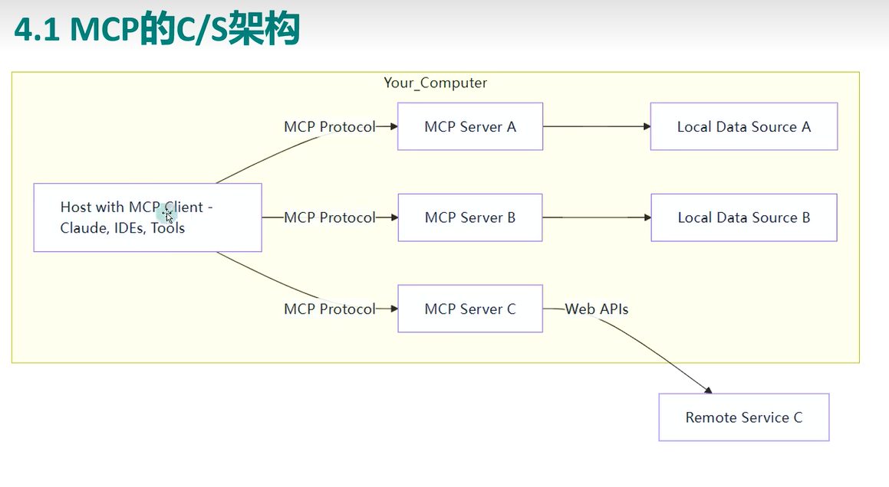

# AI

## 基础介绍

AI领域划分：
- 机器学习ML：
- 深度学习DL：
- 自然语言处理NLP：
- 计算机视觉CV：
- 生成模型GenAI：
- 知识图谱、推理：
- 机器人学：

AI学习：
- 监督学习（Supervised Learning）	有标签的数据训练，比如图像分类
- 无监督学习（Unsupervised Learning）	没标签，让模型自己找规律
- 半监督学习（Semi-supervised）	小量标签 + 大量无标签
- 强化学习（Reinforcement Learning）	奖励机制引导学习，比如玩游戏
- 迁移学习（Transfer Learning）	把学到的知识迁移到新任务上
- 自监督学习（Self-supervised Learning）	自动生成标签训练，比如BERT模型
- 生成对抗网络（GAN）	两个网络互相对抗，生成逼真内容
- 大模型预训练（Pretraining）	GPT、Llama、Gemini 都是靠预训练

### A2A

### LLM

大语言模型

### MCP

模型上下文协议

