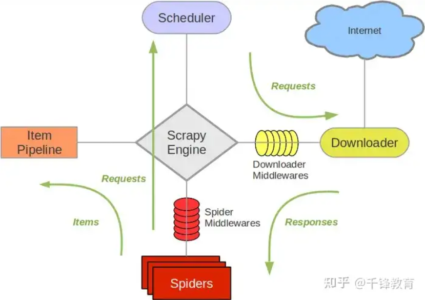

# Scrapy

>
> `千锋scrapy教程：P11`
>


## 基础介绍


spider -> middleware -> engine -> scheduler -> downloader -> middleware -> item pipeline



### 项目结构
```yaml
:
    /project:
        /spiders:
            __init__.py:
            spider.py: # 爬虫
        __init__.py:
        items.py: # 结构对象
        middlewares.py: # 中间件（爬虫、下载）
        pipelines.py: # 结构对象处理管道
        settings.py: # 配置
    scrapy.cfg
```

#### settings.py
```yaml
settings.py:
    CONCURRENT_REQUESTS: # 并发请求
    DOWNLOADER_MIDDLEWARES: # 下载中间件
    ITEM_PIPELENES: # 处理管道
    USER_AGENT: # 代理（浏览器）
```


### scrapy
```yaml
scrapy:
    crawl: # 运行爬虫
        -o:
        --nolog:
    genspider: # 生成爬虫
    shell:
    startproject: # 创建项目
    version:
```


## 核心内容
```yaml
scrapy:
    http:
        HtmlResponse:
            urljoin():
    DownloaderMiddleware:
        from_crawler():
            crawler:
                signals:
                    connect():
        process_request(): # 请求拦截处理
            request:
            spider:
        process_response(): # 响应拦截处理
    Field: # 结构字段
    Item: # 结构对象（爬取的），由spider::parse()方法返回
    Pipeline:
        close_spider():
        open_spider():
        process_item(): # 处理item结构对象
            item:
            spider:
    Request: # 新请求对象，由spider::parse()方法返回
    Selecttor: # 元素选择器
        css(): # css选择器
        re():
        xpath():
            extract_first(): # 第一个匹配元素
    Spider: # 爬虫基类
        allowed_domains:
        name: # 爬虫名
        start_urls: # 起始页
        parse(): # url响应解析
            response:
        start_requests(): # 构造请求对象
    SpiderMiddleware:

```


