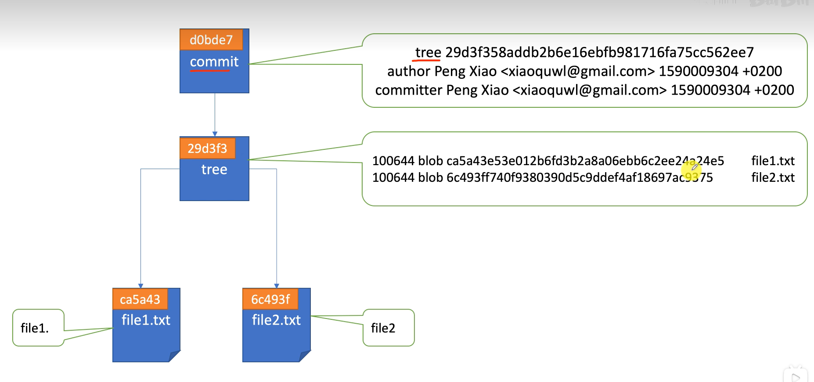
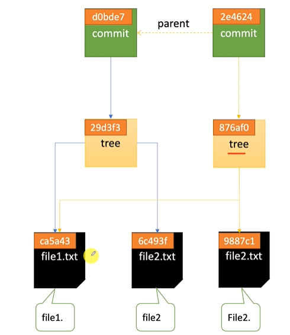
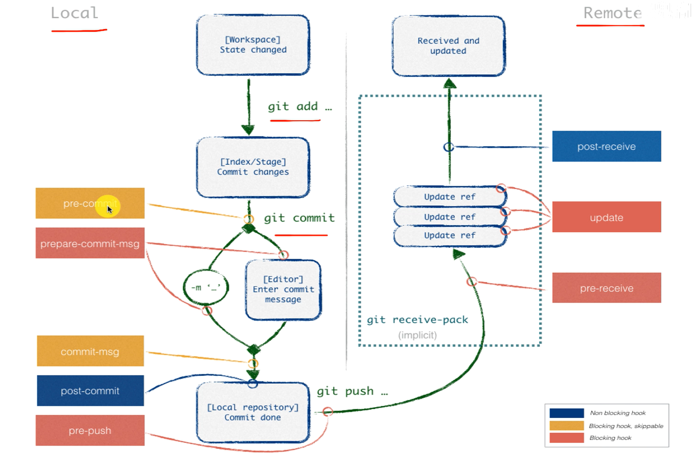

# git

`深入理解GIT: P17`

## 基础介绍

分布式版本控制系统
版本管理、代码共享、代码整合
- working directory：工作区
- staging area：暂存区
- repository：仓库


pull = fetch + merge
pull request: 远程代码分支合并


git-object类型：四大对象
- blob: 	文件内容
- tree: 	文件夹结构，记录 blob 和 tree 的引用
- commit:	一次提交，记录 tree 的快照和父 commit
- tag:	    提交的标签


git文件状态：
- untracked
- modified
- staged
- unmodified


分离头指针：Head指向具体的commit，而不是某一branch分支
git底层核心内容：存储、引用、日志、钩子


### git
```yaml
git:
    --version:
    add: # 缓存stash
        .: # 所有操作纳入暂存区
    apply: # 使用patch补丁
    archive: # 创建文件归档
    backfill:
    bisect:
    blame: # 查看文件的修改历史
    branch: # 分支查看
        -d: # 删除分支
        -D:
        -r: # 远程分支查看
        -v: # 查看分支（详细信息）
    bundle: 
    cat-file: # 查看git对象objects文件
        -p: # 查看对象内容
        -s: # 查看文件长度
        -t: # 查看对象类型
    checkout: # 切换分支（也可切换到commit中，分离头指针状态）
        --: # 丢弃未暂存修改
        -b: # 指定分支
    cherry-pick: # 选择并应用指定的commit修改，多分支操作
    clean: # 从工作区中移除未跟踪的文件
    clone: # 克隆仓库
    commit: # 提交
        -a: # 所有文件
        -m: # 提交备注信息
        --amend: # 直接作用于当前commit,把当前暂存区（staged）的内容合并进上一次提交，不产生新的commit
            --no-edit: # 保留commit信息
    config: # 配置管理
        -l:
        --list: # 列出所有配置
        --local:
        --global: # 全局（用户）配置
        --system: # 系统配置
        --unset: # 删除配置变量
        alias: # 命令别名
        merge:
            tool:
        mergetool:
            keepBackup:
            path:
        user: # 用户信息配置
            email:
            name:
    diff: # 查看工作区与暂存区之间的差异
        --cached: # 显示暂存区（index 文件）和最近一次提交（也可指定某一次提交）之间的差异
    fetch: # 仅下拉（下拉到本地仓库）,修改本地远程仓库信息
        --prune: # 清空悬空垃圾objects对象
    format-patch: # 创建patch补丁
    fsck: # 查看悬空垃圾objects对象
    gc: # objects对象压缩
    grep: # 代码库中查找指定片段 (文本查找)
    help: # 查看帮助
    init: # 仓库初始化
    log: # commit日志
        -n:
        --graph:
        --oneline:
        --pretty-format: # 自定义格式输出
        --source: # 详细commit信息
    ls-files: # 查看index索引文件,列出所有文件
        -s: # staged的文件
        --stage: # 显示详细的索引信息，包括文件的状态和哈希
    ls-tree:
    merge: # 分支合并（把指定的分支合并到当前分支上）
        --no-ff: # 禁用fast-forward，手动再提交一次
    mergetool: # 分支合并工具
    mv: # 文件重命名（操作已纳入缓冲区）
    prune: # 清空悬空垃圾objects对象
    pull: # 下拉（合并到本地分支，下拉到工作区）
    push: # 推送
        -d: # 删除远程分支
        -u: # set-upstream别名，远程推送（别名 分支）
        --set-upstream: # 设置远程仓库关联分支，用于将本地分支与远程仓库中的分支关联，并且将本地分支的更改推送到远程分支上，<remote> <local-branch>:<remote-branch>
        --tags: # 推送tag标签
    rebase: # 切换commit（分支线性变基，用于合并commit、commit分支转线性、）(rebase应该在push之前)
        --abort:
        --continue:
        edit:
        exec:
        drop:
        fixup:
        pick:
        reword:
        squash: # 合并到前一个commit
    reflog: # 查看所有历史操作记录（操作日志）
        -n: # 查看数量
    remote: # 远程仓库管理
        -v: # 查看远程仓库
        --verbose:
        add: # 添加远程仓库（仓库别名 url）（默认origin）
        get-url:
        prune: # 清空悬空垃圾objects对象
        remove:
        rename:
        rm:
        set-branches:
        set-head:
        set-url:
        show: # 显示远程仓库信息
    reset: # commit回滚
        --hard: # 切换commit记录
        --mix: # 删除最近的 commit，并保留文件修改（不保留 staged 状态）
        --soft: # 删除最近的 commit，但保留文件修改,会将变更保留在暂存区（staging area） 
        HEAD: # 取消暂存区缓存（变回未缓存状态）
        ORIG_HEAD:
    restore: # 去除文件修改
        --staged: # 移除暂存区文件
    revert: # 撤销指定提交的修改
    rm: # 直接从工作区和暂存区中删除指定的文件（删除修改会被纳入到暂存区）
        -r: # 递归
        --cached: # 移除暂存区文件(从暂存区中删除文件，但保留工作区中的文件)
    shortlog:
    show: # 查看提交的详细信息(hash、tag)
    show-branch:
    stash: # 暂存所有修改（临时保存）
        apply: # 取出临时保存的修改（不删除这个临时保存）
        drop: # 手动删除临时保存
        list: # 列出所有临时保存
        pop: # 取出临时保存的修改（并删除这个临时保存）
        save: # 临时保存
    status: # 仓库状态
    submodule: # 管理子模块
        add: # 添加子模块
        status:
        update:
            --init:
            --recursive:
            --remote:
    switch: # 切换分支
    tag: # 列出标签（标签需手动push）
        -a: # 添加标签（在当前commit添加）
        -d: # 删除标签
        -l: # 查找标签
        -m: # 标签描述（带注释的标签）
    unpack-objects: # 解压缩 objects pack
    verify-pack: # 查看 objects pack 压缩信息
        -v:
    worktree: # 工作树
        add:
        list:
        lock:
        remove:
```


#### .gitconfig
```yaml
.gitconfig:
    branch: # 分支配置
        merge:
        remote:
    core: # 核心配置
        excludesfile:
    credential:
        provider:
    filter:
        clean:
        process:
        required:
        smudge:
    http:
        sslVerify:
    merge:
        tool:
    mergetool:
        path:
    remote: # 远程仓库配置，origin名称可选
        fetch:
        url:
    submodule: # git子模块
        path:
        url:
    user: # 用户信息配置
        email:
        name:
```

本地配置、全局配置、系统配置
`.git/config`、`~/.gitconfig`


#### .gitignore

git 管理忽略文件
- *规则通配
- **递归通配
- !规则除外


## 核心内容
```yaml
.git: # 存储、引用、日志、钩子
    /branches:
    /hooks: # Git 钩子
        pre-commit:
        pre-push:
        post-commit:
    /info: # 额外的配置信息
        exclude:
    /logs: # git操作日志，
        /refs:
            /heads:
                master:
    /objects: # hash，所有对象（blob, tree, commit，tag）都存这里，通过 SHA-1 哈希值命名，2 个字符的目录和剩下的 38 个字符的文件名
        /info:
        /pack: # objects 合并压缩
            pack-xxx.idx:
            pack-xxx.pack:
    /refs: # 引用，保存分支（refs/heads）和 tag（refs/tags），每个引用都指向一个 Git 对象（通常是一个提交对象）
        /heads: # 分支指针
            main:
            master: # master分支指针，指向objects中的hash commit
        /remotes: # 远程仓库
            /origin: # 自定义origin远程仓库名
                main:
                master:
        /tags: # 标签
            v1.0.0:
    COMMIT_EDITMSG:
    config: # 本地git配置，局部项目配置
    description: # 仓库描述
    FETCH_HEAD:
    HEAD: # 当前分支指针
    index: # 暂存区（staging area），保存了已暂存的文件的哈希值和文件状态，二进制格式
    ORIG_HEAD: # 上一次HEAD commit 指针
    ORRG_HEAD: # 远程commit指针
    packed-refs: # Git 引用的压缩版本，包含了所有的分支和标签的引用
```

git工作区文件


objects文件中包含了object类型、长度、文件内容


### Branch

默认分支：master

branch分支仅仅是commit的指针


#### Pull Request

请求将目标分支合并到指定分支（远程）


### Commit
```yaml
commit 对象:
    Tree object: # 树对象，指向该提交的文件快照，表示这次提交包含了哪些文件、文件内容以及文件的修改状态
    Parent commit: # 父提交,指向一个或多个提交对象，表示当前提交是基于哪些提交产生的。如果是初始提交（root commit），则没有父提交
    Commit message: # 提交信息,描述该提交的变更内容
    SHA-1 hash: # 提交哈希,每个提交对象都有一个唯一的 SHA-1 哈希值，用于标识该提交

commit 规范:
    chore: # 维护任务，更新构建任务等
    docs: # 文档变更
    feat: # 添加新特性
    fix: # 修复bug
    perf: # 优化相关的性能提升
    refactor: # 重构（即代码改动，但不影响功能）
    style: # 代码格式（如缩进、空格等），不影响代码逻辑
    test: # 增加或修改测试代码
```
提交



commit -> tree -> file

git merge类型：
- fast-forword


#### Tag

commit语义化标签


### Tree

Tree 对象用于表示一个目录，它包含了该目录下所有文件和子目录的元数据（文件名、权限、指向 Blob 或其他 Tree 对象的指针等）

#### Blob

每个文件的内容都对应一个 Blob 对象
文件的内容变化时，Git 会创建一个新的 Blob 对象


### HOOKS



- pre-commit
- post-commit
- pre-push
- update


bash脚本


### SubModule

git子模块


### WorkTree

多分支同时操作


## github

### github desktop

github官方GUI工具


## gitlab

国内gitlab代理

可本地搭建


### gitlab-ctl
```yaml
gitlab-ctl:
    start:
```


### 提交

#### Pull request

#### 标记

（不是commit的标签）

#### 议题


### 工作流


#### Runner


### 用户管理

用户、访问级别、群组、


#### 群组

