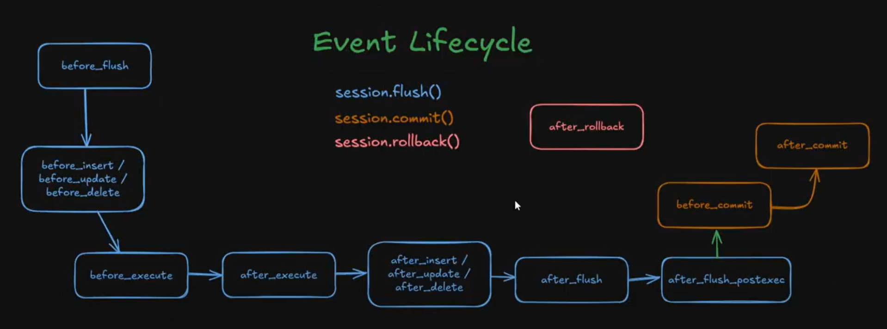

# SQLAlchemy

`SQLAlchemy官方文档：https://docs.sqlalchemy.org/en/20/orm/mapping_styles.html#orm-mapping-styles`

## 基础介绍


SQLAlchemy 是 Python 中最强大、最主流的数据库框架之一，支持 ORM(Session) 和原生 SQL(Connection) 构建器
数据库驱动包：
- mysqlclient


SQLAlchemy常用三大组件：Engine、Session、Connection
- 获取数据库引擎(数据库连接信息)Engine -> 获取数据库连接Connection -> 执行SQL 
- 获取数据库引擎(数据库连接信息)Engine -> 数据库表元信息MetaData -> 数据库表信息Table -> metadata创建表 -> 利用Table创建SQL语句(Insert、Delete...) -> 获取数据库连接Connection执行SQL语句
- 获取数据库引擎(数据库连接信息)Engine -> 定义模型类继承基类DeclarativeBase -> 模型类metadata创建表 -> 获取会话Session绑定Engine执行SQL操作    （这种方法类似MyBatis）


一个engine对应一个数据库
模型类中互相持有，就需要定义back_populates后置填充
ORM使用方式：4种
1. Table: 表结构定义
    - Column:
    - mapper(): 手动映射表结构和模型实体类 
2. declarative_base()：模型表结构定义（目前教程大部分）
    - Colomun(Integer):
    - relationship()/ForeignKey:
    - Session操作ORM
        - session.query(Entity)：条件查询
3. DeclarativeBase：模型表结构定义
    - Mapped/mapped_column()：
    - relationship()/ForeignKey:
    - session.query(Entity)
4. select(): sql构造（推荐）
    - session.execute(select(Entity))


sqlalchemy中没有ActiveRecord风格的操作，默认都是要通过session进行操作的（Flask-SQLAlchemy进行了封装）


## 核心内容
```yaml
sqlalchemy:
    dialects: # 方言
        mysql:
        postgresql:
        sqlite:
    engine: # 引擎包
        base:
            Connection: # 连接
                begin(): # 开启事务
                    commit():
                    rollback():
                close():
                execute(): # 执行原始sql
            Engine: # 引擎
                begin():
                connect(): # 获取Connection
                dispose():
        cursor: # 游标结果
            CursorResult:
                inserted_primary_key:
                fetchall():
                fetchone():
    event: # 事件扩展机制
        @listens_for():
            before_insert:
            before_update():
            load: # 模型加载
            refresh:
            refresh_flush:
        contains():
        listen(): # 事件监听
        remove():
    ext: # 扩展
        asyncio:
        compiler:
        declarative: # 基类声明创建
            declarative_base():
        hybrid:
    orm: # ORM
        query:
            Query:
                all():
                filter():
                first():
                one():
        DeclarativeBase: # 模型基类声明
            __abstract__: # 抽象基类
            __allow_unmapped__: #
            __table__: # Table元表信息
            __tablel_args__: # 表参数
            __tablename__: # 表名
            metadata: # 数据库元表
                tables: # 数据库表map
                    indexes:
                create_all(): # 创建数据库表
            registry:
            type_annotation_map: # 字段类型 数据库类型 映射
        Mapped: # 模型字段声明
        Mapper:
        Session: # 模型操作工具类
            add(): # 添加数据
            add_all():
            begin(): # 开启事务
            close(): # 关闭连接
            get(): # 根据组件查询
            get_one():
            delete(): # 删除数据
            update(): # 更新数据
            execute(): # 执行sql构造语句
            query(): # 条件查询（传入ORM实体类）
                options(): # 关联查询配置
                    contains_eager():
                    defaultload():
                    defer(): # 延迟加载字段
                    immediateload():
                    joinedload():
                    lazyload():
                    load_only():
                    noload():
                    selectinload():
                    subqueryload():
                    undefer():
                    undefer_group():
                all():
                first(): # 第一条
                one(): # 查询一条
                one_or_none():
                where(): # 条件过滤
                filter(): # 条件过滤
                filter_by(): # 条件过滤，可以不写Entity
                    or_(): # 布尔逻辑
                    not_(): # 布尔逻辑 
                join(): # 联表
                    full:
                    isouter:
                outerjoin():
                union():
                group_by(): # 分组
                limit():
                offset():
                order_by(): # 排序
            scalars(): # select构造语句执行
                first():
                one():
            merge():
            expire():
            expunge():
            flush(): # 刷新（提交事务）
            refresh():
            commit(): # 提交事务
            rollback():
        aliased(): # 定义表别名
        declarative_base(): # 创建模型基类, 旧版SQLAlchemy ≤1.4，新版使用DeclarativeBase
        deferred(): # 延迟加载字段 
        mapped_column(): # 模型字段属性定义
            index: # 字段索引
            nullable: # 可空类型
            primary_key: # 主键字段
            server_default: # 默认值
            unique: # 唯一约束
        registry(): # 命令式映射
            metadata:
        relationship(): # 关联模型字段属性定义
            back_populates: # 后置填充
            backref: # 逆向添加本身引用（给关联表添加一个引用自身的字段）
            cascade: # 级联操作
                merge:
            lazy:  # 懒加载关联字段
                dynamic:
                joined: # 连表查询
                raise:
                select: # 子查询
                selectin: # in子查询
                subquery:
                write_only:
            remote_side: # 远端、父端声明
            secondary: # 中间表
            use_list: # 列表关联
        sessionmaker(): # 获取session基类(实例化后继续使用)
    schema: # 表结构定义
        Column: # 旧版字段定义
            nullable:
            primary_key:
            unique:
        ForeignKey: # 字段类型 外键
        Index: # 字段索引
            create():
                bind:
            drop():
        Metadata: # 数据库元表
            create_all(): # 创建表（创建之前会查询)
        Table: # 定义表信息
            c: # 所有列
            delete():
            insert():
            join(): # 表连接
            select():
            select_from():
            update():
    sql: # 原始SQL构造查询
        dml:
            Delete:
            Insert:
                values():
            Update:
        expression:
            and_():
            delete(): # 删除sql构造
            insert(): # 插入sql构造
            not_():
            or_():
            select(): # 查询sql构造
                join(): # 关联查询
                options(): # 
                    selectinload(): # 预加载
                where(): # 查询条件构造
                    ==:
                    contains():
                    in_():
            update(): # 更新sql构造
        func: # 聚合函数
            count():
            now():
        selectable:
            Select: # selct()对象
                join():
                join_from():
                order_by():
                where():
        bindparam():
        text(): # 生成原始sql 
    testing: # 测试
    util: # 工具
    types: # 数据类型
        Date:
        Integer: # 字段类型 整形
        String: # 字段类型 字符串
        Text:
    __version__: # 版本
    create_engine(): # 创建数据库引擎
        echo: # 显示执行的SQL
    
```


### Model
```python
Base = declarative_base()

class User(Base):
    __tablename__ = 'users'
    id: Mapped[int] = mapped_column(Integer, primary_key=True)
    name: Mapped[str] = mapped_column(String)
```

旧版模型定义：
- declarative_base、Column
- registry、Table
新版模型定义：DeclarativeBase、mapped_column、Mapped


### Session
```python
# session执行模型操作（自带事务）
with Session(engine) as session:
    spongebob = User(
        name="spongebob",
        fullname="Spongebob Squarepants",
        addresses=[Address(email_address="spongebob@sqlalchemy.org")],
    )
    patrick = User(name="patrick", fullname="Patrick Star")
    session.add_all([spongebob, patrick])
    session.commit()
```


Model模型操作工具类


#### Connection


底层数据库连接、常用于底层sql执行、不支持ORM


### Engine
```python
# 创建数据库引擎
from sqlalchemy import create_engine
engine = create_engine("sqlite://", echo=True)

# 创建数据库表（Base继承自DeclarativeBase）
Base.metadata.create_all(engine)
```

数据库连接信息（数据库连接池、连接复用）、建表


### RelationShip

模型关联操作
- relashonship声明该字段为关联字段
    - back_populates/back_ref:(单向关系一方声明、双向关系双方声明)
        - 用来显式告诉 SQLAlchemy：本类 在字段所属类里的字段名是什么
        - 双向关系自动同步（添加一端时，另一端也会更新）
    - remote_side: 在 自引用（self-referential）关系 里用来告诉 ORM 哪一边是“远端”（声明对方为父端）
    - secondary: 三表关联中间表
        - primaryjoin:
        - secondaryjoin:
- ForeignKey声明如何关联

#### One To One


#### One To Many


#### Many To Many


### Event


事件机制（拦截器扩展机制）
- before_cursor_execute




### Core
```python
mapper_registry = registry()

user_table = Table(
    "user",
    mapper_registry.metadata,
    Column("id", Integer, primary_key=True),
    Column("name", String(50)),
)
```

旧版sqlalchemy风格api

